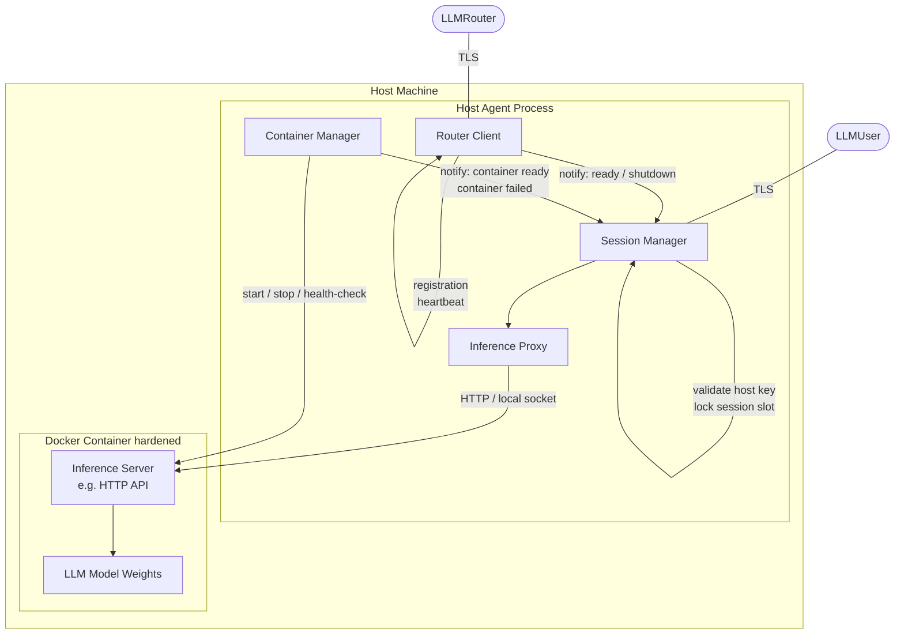
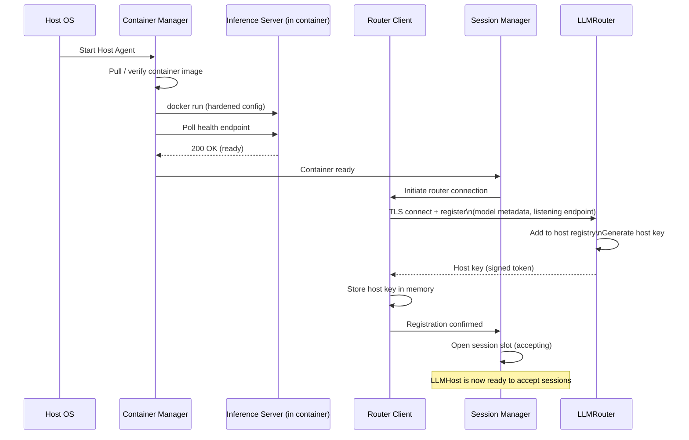
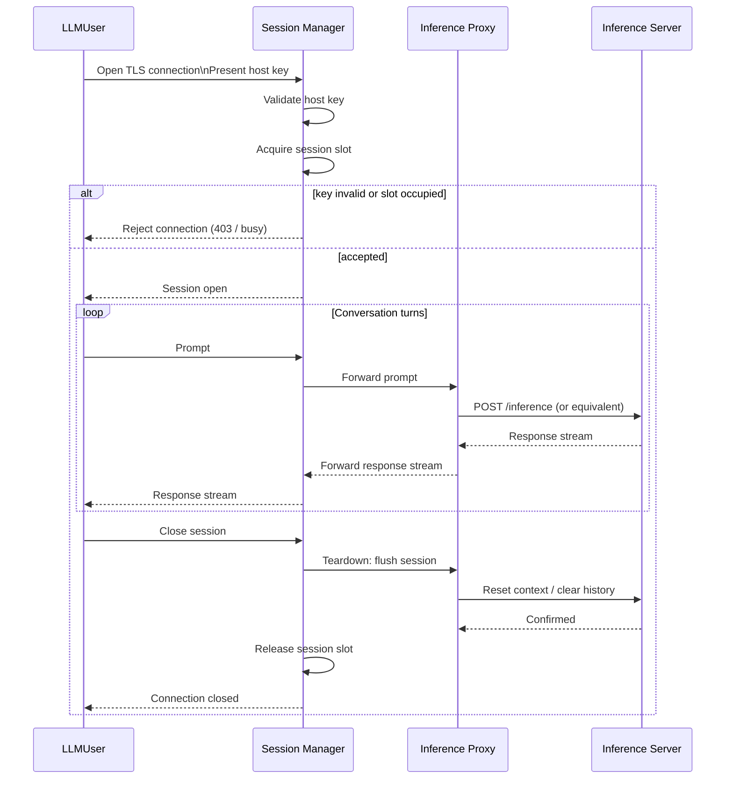

# LLMHost — Component Architecture

> **Scope:** Phase 1 (MVP). See [`architecture_overview.md`](./architecture_overview.md) for system-wide context, security model, and the phase roadmap.

---

## 1. Responsibilities (Phase 1)

The LLMHost has three distinct concerns that must be kept architecturally separate:

1. **Compute isolation** — run the LLM inside a hardened container so it cannot access the host machine.
2. **Network authority** — be the sole gatekeeper for who may open an inference session; enforce router-issued authentication.
3. **Session discipline** — accept exactly one session at a time; destroy all session state on teardown.

---

## 2. Internal Component Structure

The LLMHost is a host-side process (the **Host Agent**) that manages the container and mediates all network traffic. It is not a monolith; it is composed of four focused sub-components.

### 2.1 Router Client

Owns the persistent connection to LLMRouter. Responsibilities:

- Establish the TLS connection to the configured router address on startup.
- Send the registration payload (model metadata, listening endpoint).
- Receive and securely store the router-issued **host key** in memory (never written to disk; see §5.1).
- Emit a heartbeat on a fixed interval to keep the router registry entry alive.
- Detect router disconnection and trigger a re-registration flow.
- Signal the Session Manager when registration is confirmed (host is allowed to accept users) and when the router connection is lost (host must refuse new sessions).

### 2.2 Session Manager

The single point of entry for incoming LLMUser connections. Responsibilities:

- Maintain a **session slot** — a binary lock that is acquired when a session opens and released on teardown. In Phase 1 this enforces the one-session-at-a-time constraint.
- Validate the **host key** presented by the connecting LLMUser before any inference traffic is allowed.
- Reject connections when: (a) the session slot is occupied, (b) the router connection is not established, or (c) key validation fails.
- Hand off a validated session to the Inference Proxy.
- Coordinate session teardown: instruct the Inference Proxy to flush, then release the session slot.

### 2.3 Inference Proxy

A thin forwarding layer between the Session Manager and the container's Inference Server. Responsibilities:

- Forward prompts from the LLMUser to the Inference Server over a local interface (e.g. HTTP on a loopback or Docker bridge address).
- Stream responses back to the LLMUser.
- Apply no transformation to content — it is a transparent pipe.
- On session teardown, issue a context-reset command to the Inference Server so no conversation history persists.

> **Why a proxy rather than a direct connection?**
> Placing an explicit proxy layer here means future phases can inject policy (content filtering in Phase 3, structured tool-call parsing in Phase 2) without changing the Session Manager or the container internals.

### 2.4 Container Manager

Owns the Docker container lifecycle. Responsibilities:

- Pull and verify the container image on first run (image integrity check; exact mechanism is an open decision — see §8).
- Start the container with the hardened configuration described in §4.
- Poll the Inference Server's health endpoint until it is ready, then signal the Session Manager.
- Monitor the container process; escalate to a fatal error if it exits unexpectedly.
- On shutdown, send a graceful stop signal to the container, wait for it to exit, then remove it.

---

## 3. Startup Sequence

---

## 4. Session Lifecycle

---

## 5. Security Design

### 5.1 Host Key Storage

The host key received from the router is held **in process memory only**. It is never written to disk. Consequences:

- If the Host Agent restarts, it must re-register with the router to obtain a new key.
- Any LLMUser holding the old key is automatically invalidated — they must reconnect through the router.
- This is intentional: it prevents a stale key on disk from being used to impersonate a host after a restart.

The Router Client also receives and stores the **router's Ed25519 public key** during the registration handshake. This public key is used by the Session Manager to verify the signature on any host key presented by a connecting LLMUser. The public key may be pre-configured out-of-band as an alternative to receiving it over the wire. See [ADR-0001](./adr/0001-asymmetric-host-key-signing.md).

### 5.2 Session Key Validation

The LLMUser presents the host key verbatim as received from the router. The Session Manager verifies it as follows:

1. **Signature check** — verify the Ed25519 signature on the token using the router's public key (held in memory by the Router Client). A token that does not pass this check is rejected immediately, regardless of its contents.
2. **Expiry check** — the signed payload includes an expiry timestamp. Tokens past their expiry are rejected.
3. **Host match check** — the signed payload includes the host identifier. Tokens issued for a different host are rejected.

All checks fail closed. No partial matches, no fallback paths. See [ADR-0001](./adr/0001-asymmetric-host-key-signing.md) for the rationale for asymmetric signing over HMAC.

### 5.3 Docker Hardening Configuration

The container is started by the Container Manager with these constraints enforced programmatically — they are not left to manual Docker configuration:

| Constraint | Rationale |
|------------|-----------|
| No volume mounts | LLM cannot read or write host filesystem |
| Isolated bridge network (not `host`) | LLM cannot see host network interfaces |
| Single port exposed (inference API only) | Minimise network attack surface |
| No internet egress route | Phase 1 constraint; prevents proxy abuse |
| Drop all Linux capabilities except what inference requires | Reduces kernel attack surface |
| No privileged mode | Prevents container escape via device access |
| Read-only root filesystem (where possible) | Prevents the LLM process from writing to the container OS layer |
| No IPC sharing with host | Prevents shared-memory side channels |
| User namespace remapping | Container root does not map to host root |

### 5.4 Session Isolation

Between sessions, the Inference Proxy sends a context-reset instruction to the Inference Server. The container itself remains running (avoiding restart overhead), but the in-memory conversation state inside it is wiped. If the Inference Server does not confirm the reset, the Session Manager must treat the container as tainted and instruct the Container Manager to restart it before accepting a new session.

---

## 6. Failure Handling

| Failure | Response |
|---------|----------|
| Router connection lost during idle (no active session) | Router Client attempts reconnection with exponential backoff. Session slot remains closed until re-registration succeeds. |
| Router connection lost during active session | Active session is allowed to complete. New sessions are rejected until re-registration succeeds. |
| Container exits unexpectedly (idle) | Container Manager restarts the container and re-runs the health-check loop. Session slot remains closed. |
| Container exits unexpectedly (during session) | Session is terminated. LLMUser receives an error. Container Manager restarts the container. The host re-registers if the host key has been lost. |
| Context-reset not confirmed after session teardown | Container Manager restarts the container. Host key is still valid; no re-registration needed unless the Inference Server is the key holder (it is not — the Router Client holds it). |
| Session slot occupied when new connection arrives | Immediate rejection with a "host busy" error. No queue is maintained in Phase 1. |

---

## 7. Phase Roadmap — LLMHost Impact

| Phase | Change | What it means for LLMHost |
|-------|--------|---------------------------|
| **1** | MVP | Architecture described in this document. |
| **2** | Structured tool-call responses (file writes, shell commands on user machine) | Inference Proxy must parse structured output from the Inference Server and forward it as typed payloads rather than raw text. Session Manager must handle a richer protocol. |
| **3** | Controlled internet access | Container networking gains a filtered egress proxy. Container Manager must configure the container's DNS and routing to go through that proxy. No egress outside the allowed list. |
| **4** | Multiple simultaneous sessions | Session Manager's binary session slot becomes a capacity counter or a queue. Router Client must report current load so the router can make routing decisions. Session isolation (§5.4) becomes more critical. |
| **Future** | Resource accounting | Host Agent gains a metering layer that tracks token throughput and reports to the router for credit/debit accounting. |

---

## 8. Open Design Decisions

These are decisions that must be made before implementation but are not resolved at architecture level. Each is a candidate for an ADR (see [`architecture_decision_record.md`](./architecture_decision_record.md)).

| # | Question | Status | Notes |
|---|----------|--------|-------|
| 1 | **Host key signing algorithm** | Decided — [ADR-0001](./adr/0001-asymmetric-host-key-signing.md) | Ed25519 asymmetric signing. Router holds private key; hosts verify with router's public key. |
| 2 | **Inference Server inside container** | Open | The specific LLM serving software (e.g. llama.cpp server, Ollama, vLLM). Determines the local API protocol the Inference Proxy speaks. |
| 3 | **Container image integrity verification** | Open | Digest pinning in config vs. a signature scheme (e.g. Sigstore/cosign). Digest pinning is simpler for Phase 1. |
| 4 | **Inference Proxy ↔ Inference Server transport** | Open | HTTP on the Docker bridge vs. a Unix socket. Unix socket avoids opening any network port inside the container but may complicate Docker networking setup. |
| 5 | **Context-reset mechanism** | Open | Depends on the chosen Inference Server. Some support an explicit `/reset` endpoint; others require a fresh process. This determines whether the container must be restarted between sessions. |
| 6 | **Re-registration identity** | Open | When the Host Agent restarts, how does it prove to the router it is the same host (to reclaim its slot) vs. a new host? Public/private keypair on the host machine is a natural answer. |
