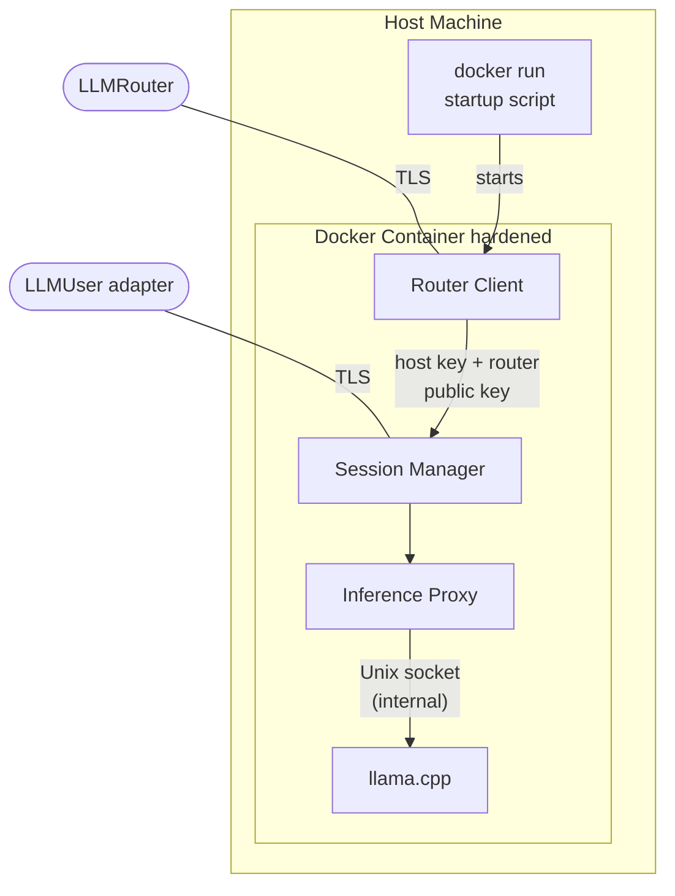
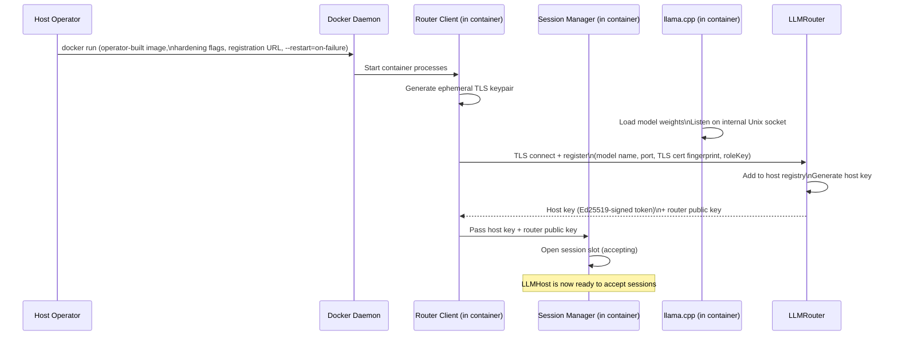
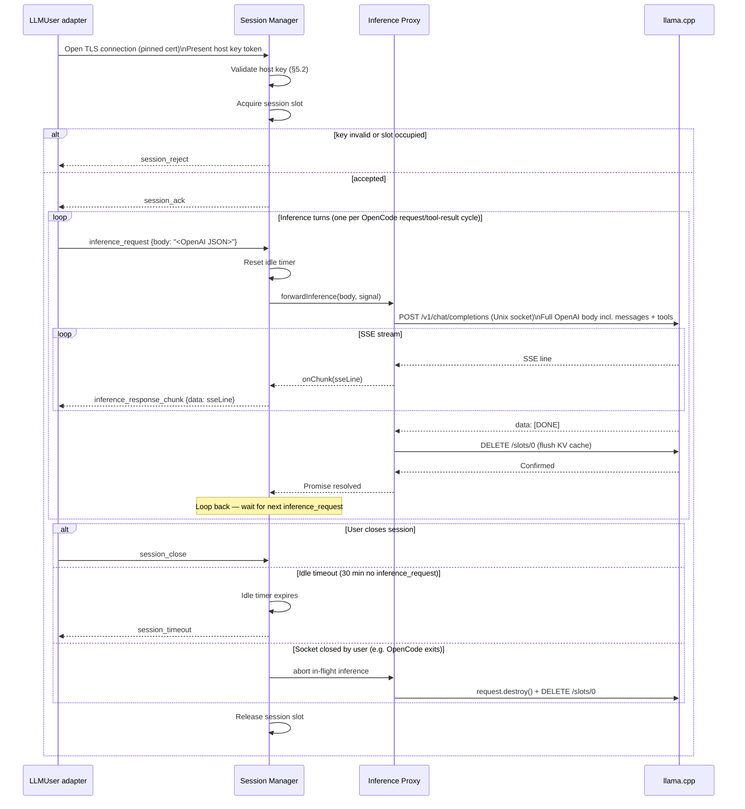

# LLMHost — Component Architecture

> **Scope:** Phase 1 (MVP) and Phase 2 (OpenCode provider + tool-call pass-through). See [`architecture_overview.md`](./architecture_overview.md) for system-wide context, security model, and the phase roadmap.

---

## 1. Responsibilities

The LLMHost has three distinct concerns that must be kept architecturally separate:

1. **Compute isolation** — run the LLM inside a hardened container so it cannot access the host machine.
2. **Network authority** — be the sole gatekeeper for who may open an inference session; enforce router-issued authentication.
3. **Session discipline** — accept exactly one session at a time; destroy all session state on teardown.

**Phase 2 addition:** the LLMHost becomes a transparent inference tunnel. The Inference Proxy forwards the full OpenAI request body (including tool definitions) verbatim to llama.cpp and streams raw SSE lines back to the LLMUser adapter. No parsing, no content extraction. Tool execution happens on the user machine, not here.

---

## 2. Internal Component Structure

The LLMHost is a single Docker container. All logic — router client, session management, inference proxying, and LLM inference — runs inside it. **Operators build their own image** with their chosen LLM (llama.cpp is the reference implementation and is used throughout this document; any inference engine satisfying the internal API contract may be substituted). Once the image is built, the host machine's only operational responsibility is starting the container with the correct hardening flags and registration URL.

### 2.1 Router Client

Owns the connection to LLMRouter. Responsibilities:

- Generate an ephemeral TLS keypair at startup. The private key is held in memory only and is never written to disk.
- Parse the `fp`, `key` and `mode` query parameters from `SHAREGRID_ROUTER_URL`. `SHAREGRID_ROUTER_URL` must be the **host registration URL** (containing the host-specific `key`); it is distinct from the user access URL and cannot be used by LLMUsers. The `fp` value is a SHA-256 hex fingerprint prefixed with `sha256:` (e.g. `sha256:a3f1c2d4e5b6...`), matching the format printed by the router at startup (see [`architecture_llmrouter.md`](./architecture_llmrouter.md) §7). The `mode` value (`lan` default, or `internet`) is the **router's network mode**; the host advertises its session endpoint in the address family the mode dictates — IPv4 in `lan` mode, globally-routable IPv6 in `internet` mode. The host relays its IP address *according to the router's mode*; it does not select the family independently.
- Establish the TLS connection to the configured router address, pinned to the `fp` fingerprint.
- Send the registration payload: the host `key`, model name, the Session Manager's listening port, the advertised `listenHost` (IPv4 in `lan` mode, IPv6 literal in `internet` mode), and the TLS cert fingerprint so LLMUser adapters can pin to it. The router validates the host `key` before admitting the registration, and composes the registry `endpoint` from `listenHost` + port — bracketing IPv6 literals (`[2001:db8::1]:9000`).
- Receive and store the router-issued **host key** (as `current_token`) and the **router's Ed25519 public key** in memory.
- Pass the current host key token and the router public key to the Session Manager once registration is confirmed.
- Emit a heartbeat on a fixed interval. Each heartbeat response carries a freshly issued host key token from the router; on receipt, rotate: `previous_token ← current_token`, `current_token ← new token`. Notify the Session Manager of the updated token pair. Clear `previous_token` after a 60-second grace period.
- On router disconnection, attempt reconnection with exponential backoff (initial delay 1 s, doubling on each attempt, capped at 60 s) and signal the Session Manager to stop accepting new sessions until re-registration succeeds.

### 2.2 Session Manager

The single point of entry for incoming LLMUser connections. Responsibilities:

- Maintain a **session slot** — a binary lock acquired when a session opens and released on teardown. Enforces the one-session-at-a-time constraint (Phase 1–2).
- Validate the **host key** presented by the connecting LLMUser adapter against the current token pair (current + previous) before any inference traffic is allowed (see §5.2).
- Reject connections when: (a) the session slot is occupied, (b) router registration is not confirmed, or (c) key validation fails.
- Enter an **inference loop** after session open: accept sequential `inference_request` messages, forward each to the Inference Proxy, stream `inference_response_chunk` messages back, and loop. The session remains open and the slot remains occupied between inference turns.
- Maintain an **idle timer** that resets each time an `inference_request` is received. If no request arrives within 30 minutes, the Session Manager closes the session and triggers normal teardown.
- Coordinate session teardown: instruct the Inference Proxy to flush the llama.cpp slot, then release the session lock.
- On slot-erase failure, exit the container with a non-zero code — Docker's `--restart=on-failure` policy will restart it and trigger a clean re-registration.
- On TLS socket close/error during an active inference: abort the in-flight request (via `AbortSignal`), flush the llama.cpp slot, release the session lock.

#### Session protocol (Phase 2)

The Session Manager exposes a raw **TLS server** using the ephemeral TLS keypair. The LLMUser ↔ LLMHost session uses newline-delimited JSON framing (see `implementation_guidelines.md` §6):

- On connection, the LLMUser adapter sends a `session_open` message carrying the host key token.
- The Session Manager responds with `session_ack` (accepted) or `session_reject` (slot occupied, invalid token, or router not registered).
- Once open, the session enters an **inference loop**:
  - The LLMUser adapter sends an `inference_request` message carrying the serialised OpenAI `/v1/chat/completions` request body (messages, tools, tool_choice, etc.) as a JSON string.
  - The Session Manager forwards the body to the Inference Proxy, which posts it verbatim to llama.cpp.
  - The Inference Proxy streams raw SSE lines back; each line is wrapped in an `inference_response_chunk` message and forwarded to the LLMUser adapter.
  - When the `data: [DONE]` SSE line is detected, the Inference Proxy flushes the llama.cpp KV cache slot, then signals completion. The Session Manager loops back to wait for the next `inference_request`.
- Either party may send `session_close` to end the session gracefully. The session slot is released and the KV cache is flushed if an inference was in progress.
- If the idle timer expires (no `inference_request` received for 30 minutes), the Session Manager sends `session_timeout` and closes the connection.

The session slot is tied to the **TLS connection**: acquired on `session_ack`, released when the connection closes.

### 2.3 Inference Proxy

A thin forwarding layer between the Session Manager and llama.cpp. Phase 2 design:

- **`forwardInference(body: string, onChunk: (sseLine: string) => void, signal: AbortSignal): Promise<void>`** — posts the raw OpenAI request body to llama.cpp's `/v1/chat/completions` endpoint over the internal Unix socket. Emits each raw SSE line via `onChunk` (e.g. `"data: {...}"`, `"data: [DONE]"`). Resolves when `[DONE]` is emitted or when `signal` is aborted. No content parsing; no text extraction; no tool-call awareness — this is a transparent pipe.
- **`flushSlot(): Promise<boolean>`** — calls llama.cpp's `DELETE /slots/0` to wipe the KV cache. Called after each completed or aborted inference turn. Returns `false` on failure; the Session Manager exits the container on `false`.
- On `signal` abort: destroys the HTTP request to llama.cpp; calls `flushSlot()`.

The Inference Proxy uses Node.js's built-in `http.request` with `socketPath: '/tmp/llama.sock'`. This is the fixed internal path; it is not configurable at runtime.

> **Why raw pass-through rather than typed messages?**
> llama.cpp's OpenAI-compatible API already handles tool definitions, tool calls, and streaming natively. Passing the raw body through avoids the need to keep ShareGrid's protocol in sync with every OpenAI API feature (tool types, parallel tool calls, structured outputs, etc.). ShareGrid is a secure transport, not a content processor.

### 2.4 llama.cpp (Inference Server)

Runs the LLM model and serves the inference API. Configuration:

- `--unix-socket /tmp/llama.sock` — listens on an internal Unix socket only; no network port is opened for this channel.
- `--parallel 1` — single inference slot; enforces one active request at a time.
- **Tool calling** — llama.cpp's OpenAI-compatible API supports tool calling natively; Phase 2 requires no llama.cpp configuration change.
- **CPU-only** — no CUDA, Metal, or ROCm in Phase 1–2. GPU support is a later-phase concern.

### 2.5 Configuration

Configuration comes from two sources: values baked into the image at build time, and values supplied by the operator at `docker run` time.

#### Build-time configuration (Dockerfile ENV defaults)

| Variable | Description | Example |
|----------|-------------|---------|
| `SHAREGRID_MODEL_FILE` | Filename of the model (basename used as the advertised model name) | `Phi-3.5-mini-instruct-IQ2_M.gguf` |
| `SHAREGRID_MODEL_PATH` | Full path to the model inside the container | `/data/model.gguf` |

#### Runtime configuration (docker run environment variables)

| Variable | Required | Description | Example |
|----------|:--------:|-------------|---------|
| `SHAREGRID_ROUTER_URL` | Yes | **Host registration URL** for this network. Contains the `fp` fingerprint, the host-specific `key`, and (in internet mode) `mode=internet`. | `https://192.168.1.10:8443?fp=sha256:a3f1...&key=h-x9k2mQ...` |
| `SHAREGRID_LISTEN_PORT` | Yes | Port the Session Manager TLS listener binds to inside the container. Must match the `-p` flag. | `9000` |
| `SHAREGRID_LISTEN_HOST` | Yes | This machine's address advertised to the router as the session endpoint users dial directly — its **LAN IPv4 address** in `lan` mode, or its **globally-routable IPv6 address** in `internet` mode (must match the router's mode). A bridge-networked container cannot detect the host address itself, so `docker-run.sh` detects it on the host OS and injects it. | `192.168.1.42` / `2001:db8::1` |
| `SHAREGRID_HEARTBEAT_INTERVAL` | No | Seconds between heartbeat pings to the router. Default: `30`. | `30` |

If any required runtime variable is absent, the container exits immediately with a clear error.

---

## 3. Startup Sequence

---

## 4. Session Lifecycle (Phase 2)

---

## 5. Security Design

### 5.1 Host Key and TLS Key Storage

All keys are held **in process memory only**. Nothing is written to disk or to the host filesystem. Consequences:

- On container restart, the Router Client generates a new TLS keypair and re-registers as a new host. The previous host key and TLS cert are gone.
- Any LLMUser holding a token for the previous instance is automatically invalidated and must reconnect through the router.
- This is intentional: no stale credentials can persist across restarts, and no sensitive material is ever present on the host filesystem.

#### TLS certificate generation

The ephemeral self-signed TLS certificate is generated at process startup using the **`selfsigned`** npm package. Node.js has no built-in API for X.509 certificate generation; `selfsigned` wraps Node.js's own `crypto` primitives to produce a PEM-encoded cert and key without introducing any third-party cryptographic implementation. It is listed as a permitted runtime dependency in `implementation_guidelines.md` §13.

During normal operation, the Router Client holds two host key tokens in memory at all times: `current_token` (from the most recent heartbeat) and `previous_token` (from the heartbeat before that, retained for a 60-second grace period). Both are passed to the Session Manager and used for token validation. See §5.2.

The Router Client also receives and stores the **router's Ed25519 public key** during registration. This is used by the Session Manager to verify the signature on host keys presented by connecting LLMUser adapters. See [ADR-0001](./adr/0001-asymmetric-host-key-signing.md).

### 5.2 Session Key Validation

The LLMUser adapter presents the host key verbatim as received from the router. The token format is a dot-separated base64url-encoded payload and Ed25519 signature — see [`architecture_llmrouter.md`](./architecture_llmrouter.md) §4.2 for the full wire format specification. The Session Manager verifies it as follows:

1. **Signature check** — verify the Ed25519 signature using the router's public key. Any token failing this check is rejected immediately.
2. **Host match check** — the signed payload includes the host identifier. Tokens issued for a different host are rejected.
3. **Token freshness check** — the presented token must match either `current_token` or `previous_token` held by the Router Client. A match against `previous_token` is only accepted within the 60-second overlap window following the last heartbeat rotation. Any token matching neither is rejected.

All checks fail closed. No partial matches, no fallback paths. See [ADR-0001](./adr/0001-asymmetric-host-key-signing.md).

### 5.3 Docker Hardening Configuration

Hardening is split across two layers. The image enforces as much as possible so that a `docker run` with no hardening flags still has a reasonable baseline. The remaining constraints must be supplied by the operator at run time.

#### Dockerfile structure

The Dockerfile uses a **three-stage build**:

**Stage 1 — llama.cpp builder** — `debian:12-slim`; builds a CPU-only `llama-server` binary at a pinned git tag.

**Stage 2 — Node.js builder** — `node:22-slim`; runs `npm ci` and `npm run build` (esbuild) to produce `dist/bundle.cjs`.

**Stage 3 — runtime** — `node:22-slim`; copies only `/app/llama-server` and `/app/bundle.cjs`; installs `libgomp1` for OpenMP.

#### Image-level hardening (Dockerfile)

| Constraint | Mechanism |
|------------|-----------|
| Non-root user | `USER sharegrid:sharegrid` |
| Health check | `HEALTHCHECK` targeting llama.cpp `GET /health` over the Unix socket |
| Read-only compatible | Application writes nothing to the container filesystem at runtime; `/tmp` is the only exception, mounted as `tmpfs` at run time |

#### Runtime hardening (docker run flags)

| Flag | Purpose |
|------|---------|
| `--cap-drop ALL` | Drops all Linux capabilities |
| `--read-only` | Immutable container filesystem |
| `--tmpfs /tmp` | Writable temp directory for the llama.cpp Unix socket |
| `--no-new-privileges` | Processes cannot escalate privileges |
| `--network <isolated bridge>` | Container cannot see host network interfaces — this is why the host's advertised endpoint (LAN IPv4, or IPv6 in internet mode) must be injected via `SHAREGRID_LISTEN_HOST` rather than auto-detected. The Session Manager binds the IPv6 wildcard (`::`) in internet mode so IPv6 sessions are accepted |
| `--ipc=none` | No shared memory with host |
| `--restart=on-failure` | Docker automatically restarts on unexpected exit |
| `-p <host-port>:<container-port>` | Publishes only the Session Manager TLS port |

### 5.4 Session Isolation

After each completed or aborted inference turn, the Inference Proxy calls llama.cpp's `DELETE /slots/0` to wipe the KV cache. The model has no memory of the previous turn's tokens once this call succeeds. This happens **between turns** (not just between sessions) so that tool results from one turn do not persist into the next independent conversation context.

If the slot-erase call fails, the Session Manager exits the container with a non-zero code. Docker's `--restart=on-failure` policy restarts it and triggers clean re-registration.

### 5.5 Trust Boundary

The security measures in this document protect against **non-root host processes** and **external actors** who should not have access to the inference channel or session data.

They do not protect against a **malicious LLMHost operator** (root access to the host machine). They also do not allow the router or LLMUser adapters to **verify the contents of the Docker image** the operator is running.

**These two limitations are why ShareGrid is designed for closed groups of trusted actors, not open participation.** See [`architecture_overview.md`](./architecture_overview.md) §5.

---

## 6. Failure Handling

| Failure | Response |
|---------|----------|
| Router connection lost (no active session) | Router Client reconnects with exponential backoff (1 s → 60 s cap). Session slot remains closed until re-registration succeeds. |
| Router connection lost (during active session) | Active session is allowed to complete. New sessions are rejected until re-registration succeeds. |
| Container exits unexpectedly | Docker `--restart=on-failure` restarts it. Container re-registers as a new host. |
| Slot-erase fails after inference turn | Session Manager exits the container with a non-zero code. Docker restarts it. |
| Session slot occupied when new connection arrives | Immediate `session_reject`. No queue in Phase 1–2. |
| LLMUser idle for 30 minutes | Idle timer expires. Teardown: llama.cpp slot flushed, session lock released. User receives `session_timeout`. |
| LLMUser socket closes mid-inference | `AbortSignal` fires; Inference Proxy destroys the HTTP request; `flushSlot()` called; session lock released. |

---

## 7. Phase Roadmap — LLMHost Impact

| Phase | Change | What it means for LLMHost |
|-------|--------|---------------------------|
| **1** | MVP | Router Client, Session Manager (single prompt/response per turn), Inference Proxy (text extraction). |
| **2** | OpenCode provider integration | Inference Proxy redesigned as raw OpenAI pass-through. Session Manager updated to handle multi-turn inference loop on a persistent session. Phase 1 prompt/response/cancel protocol types removed from `sharegrid-shared`. |
| **3** | Controlled internet access | Container networking gains a filtered egress proxy. No inference code changes. |
| **4** | Multiple simultaneous sessions | Session Manager's binary slot becomes a capacity counter. `--parallel N` in llama.cpp. Router Client reports current load. |
| **Future** | Cross-group resource accounting | Metering layer inside container; router-to-router peering. |
