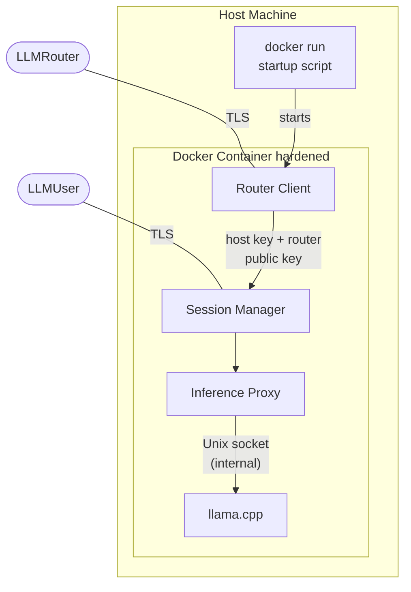
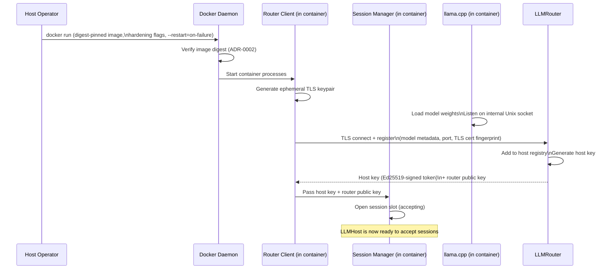
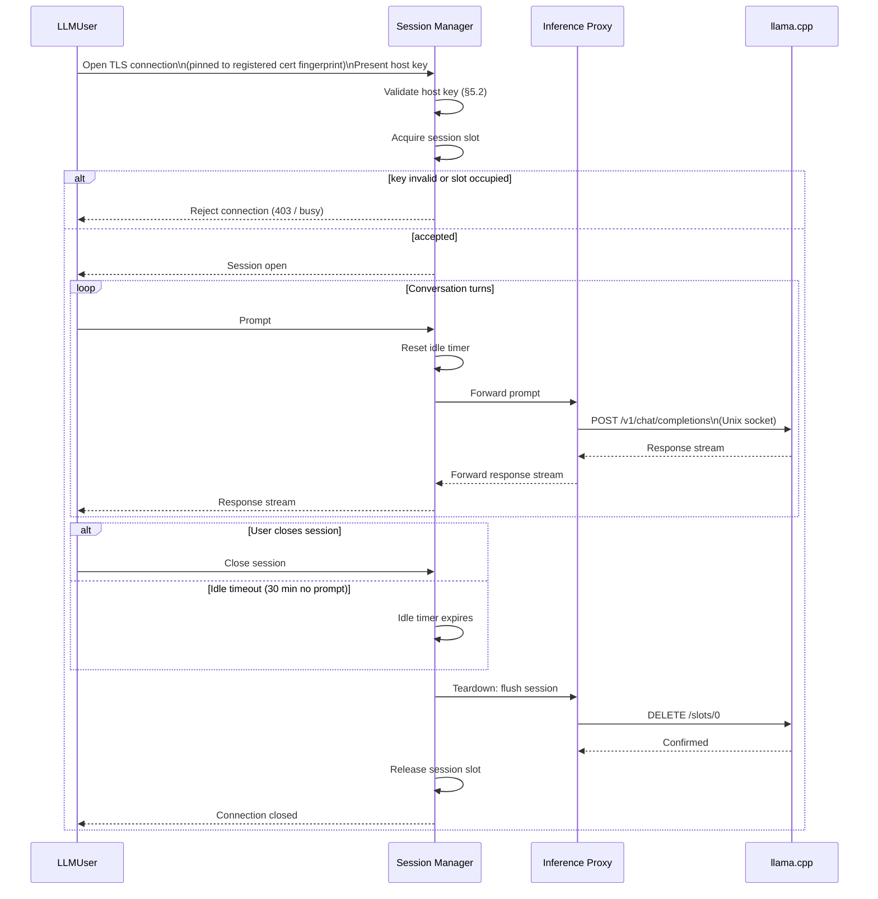

# LLMHost — Component Architecture

> **Scope:** Phase 1 (MVP). See [`architecture_overview.md`](./architecture_overview.md) for system-wide context, security model, and the phase roadmap.

---

## 1. Responsibilities (Phase 1)

The LLMHost has three distinct concerns that must be kept architecturally separate:

1. **Compute isolation** — run the LLM inside a hardened container so it cannot access the host machine.
2. **Network authority** — be the sole gatekeeper for who may open an inference session; enforce router-issued authentication.
3. **Session discipline** — accept exactly one session at a time; destroy all session state on teardown.

---

## 2. Internal Component Structure

The LLMHost is a single Docker container. All logic — routing client, session management, inference proxying, and LLM inference — runs inside it. The host machine's only responsibility is starting the container. See [ADR-0005](./adr/0005-host-agent-inside-container.md).

### 2.1 Router Client

Owns the connection to LLMRouter. Responsibilities:

- Generate an ephemeral TLS keypair at startup. The private key is held in memory only and is never written to disk.
- Parse the `fp` query parameter from `SHAREGRID_ROUTER_URL` and pin the TLS connection to that fingerprint when connecting to the router.
- Establish the TLS connection to the configured router address.
- Send the registration payload: model metadata, the Session Manager's listening port, and the TLS cert fingerprint so LLMUsers can pin to it.
- Receive and store the router-issued **host key** (as `current_token`) and the **router's Ed25519 public key** in memory.
- Pass the current host key token and the router public key to the Session Manager once registration is confirmed.
- Emit a heartbeat on a fixed interval. Each heartbeat response carries a freshly issued host key token from the router; on receipt, rotate: `previous_token ← current_token`, `current_token ← new token`. Notify the Session Manager of the updated token pair. Clear `previous_token` after a 60-second grace period.
- On router disconnection, attempt reconnection with exponential backoff and signal the Session Manager to stop accepting new sessions until re-registration succeeds.

### 2.2 Session Manager

The single point of entry for incoming LLMUser connections. Responsibilities:

- Maintain a **session slot** — a binary lock acquired when a session opens and released on teardown. In Phase 1 this enforces the one-session-at-a-time constraint.
- Validate the **host key** presented by the connecting LLMUser against the current token pair (current + previous) before any inference traffic is allowed (see §5.2).
- Reject connections when: (a) the session slot is occupied, (b) router registration is not confirmed, or (c) key validation fails.
- Hand off a validated session to the Inference Proxy.
- Maintain an **idle timer** that resets each time a prompt is received. If no prompt arrives within 30 minutes, the Session Manager closes the session and triggers normal teardown. The LLMUser receives a timeout error on the connection.
- Coordinate session teardown: instruct the Inference Proxy to flush the llama.cpp slot, then release the session lock.
- On slot-erase failure, exit the container with a non-zero code — Docker's `--restart=on-failure` policy will restart it and trigger a clean re-registration.

### 2.3 Inference Proxy

A thin forwarding layer between the Session Manager and llama.cpp. Responsibilities:

- Forward prompts from the LLMUser to llama.cpp via `POST /v1/chat/completions` over an internal Unix socket.
- Stream responses back to the LLMUser.
- Apply no transformation to content — it is a transparent pipe.
- On session teardown, call llama.cpp's `DELETE /slots/0` endpoint to explicitly wipe the KV cache before the session lock is released. See [ADR-0003](./adr/0003-llmcpp-shared-container.md).

> **Why a proxy rather than a direct connection?**
> Keeping an explicit proxy layer means future phases can inject policy — content filtering (Phase 3), structured tool-call parsing (Phase 2) — without changing the Session Manager or llama.cpp.

### 2.5 Configuration

Configuration comes from two sources: values baked into the image at build time (because they are known when the model is included), and values supplied by the operator at `docker run` time (because they differ per deployment).

#### Build-time configuration (Dockerfile ENV defaults)

These values are set as `ENV` instructions in the Dockerfile when the model is added to the image. The operator does not need to supply them — they are intrinsic to the image:

| Variable | Description | Example |
|----------|-------------|---------|
| `SHAREGRID_MODEL_NAME` | Human-readable model name advertised to the router and shown to LLMUsers | `llama-3-8b-instruct-q4` |
| `SHAREGRID_MODEL_CONTEXT_SIZE` | Context window size (tokens) advertised to the router so LLMUsers can make informed host selections | `8192` |

#### Runtime configuration (docker run environment variables)

These values cannot be known at build time and must be supplied by the operator. The Router Client reads them on startup before attempting registration:

| Variable | Required | Description | Example |
|----------|:--------:|-------------|---------|
| `SHAREGRID_ROUTER_URL` | Yes | LLMRouter endpoint the Router Client connects to | `https://router.example.com:8443` |
| `SHAREGRID_LISTEN_PORT` | Yes | Port the Session Manager TLS listener binds to inside the container. Must match the `-p` flag supplied by the operator. | `9000` |
| `SHAREGRID_HEARTBEAT_INTERVAL` | No | Seconds between heartbeat pings to the router. Default: `30` | `30` |

If any required runtime variable is absent, the container must exit immediately with a clear error message rather than starting in a partially configured state.

### 2.4 llama.cpp (Inference Server)

Runs the LLM model and serves the inference API. Configured with `--parallel 1` in Phase 1 (single slot). Communicates with the Inference Proxy exclusively via an internal Unix socket — no network port is opened for this channel. See [ADR-0003](./adr/0003-llmcpp-shared-container.md).

---

## 3. Startup Sequence

---

## 4. Session Lifecycle

---

## 5. Security Design

### 5.1 Host Key and TLS Key Storage

All keys are held **in process memory only**. Nothing is written to disk or to the host filesystem. Consequences:

- On container restart, the Router Client generates a new TLS keypair and re-registers as a new host. The previous host key and TLS cert are gone.
- Any LLMUser holding a token for the previous instance is automatically invalidated and must reconnect through the router.
- This is intentional: no stale credentials can persist across restarts, and no sensitive material is ever present on the host filesystem.

During normal operation, the Router Client holds two host key tokens in memory at all times: `current_token` (from the most recent heartbeat) and `previous_token` (from the heartbeat before that, retained for a 60-second grace period). Both are passed to the Session Manager and used for token validation. See §5.2.

The Router Client also receives and stores the **router's Ed25519 public key** during registration. This is used by the Session Manager to verify the signature on host keys presented by connecting LLMUsers. The public key may alternatively be pre-configured out-of-band. See [ADR-0001](./adr/0001-asymmetric-host-key-signing.md).

### 5.2 Session Key Validation

The LLMUser presents the host key verbatim as received from the router. The Session Manager verifies it as follows:

1. **Signature check** — verify the Ed25519 signature using the router's public key. Any token failing this check is rejected immediately.
2. **Host match check** — the signed payload includes the host identifier. Tokens issued for a different host are rejected.
3. **Token freshness check** — the presented token must match either `current_token` or `previous_token` held by the Router Client. A match against `previous_token` is only accepted within the 60-second overlap window following the last heartbeat rotation. Any token matching neither is rejected.

The overlap window handles the race condition where a user fetches the host list just before a heartbeat refresh causes the router to issue a new token. See also [`architecture_llmrouter.md`](./architecture_llmrouter.md) §4.3.

All checks fail closed. No partial matches, no fallback paths. See [ADR-0001](./adr/0001-asymmetric-host-key-signing.md).

### 5.3 Docker Hardening Configuration

Hardening is split across two layers. The image enforces as much as possible by default so that a `docker run` with no hardening flags still has a reasonable baseline. The remaining constraints must be supplied by the operator at run time.

The actual Dockerfile is deferred to the implementation phase. This section specifies what it must contain.

#### Image-level hardening (Dockerfile)

These constraints are baked into the image and apply regardless of how `docker run` is invoked:

| Constraint | Mechanism |
|------------|-----------|
| Non-root user | `USER sharegrid:sharegrid` instruction; container starts unprivileged without `--user` |
| Minimal base image | Distroless or stripped Alpine; no shell, no package manager, no debugging tools |
| Health check | `HEALTHCHECK` instruction targeting llama.cpp `GET /health`; Docker surfaces container readiness without operator configuration |
| No-new-privileges | `setpriv --no-new-privs` in the entrypoint script; processes cannot escalate privileges via setuid or file capabilities |
| No unnecessary binaries | Shells (`sh`, `bash`), `curl`, `wget`, `nc` and any other tools not required for inference are removed during the image build |
| Locked-down file permissions | All files are root-owned and readable by `sharegrid` only; no files are writable by the application process |
| Read-only compatible filesystem | The application writes nothing to the container filesystem at runtime; `/tmp` is the only exception and is mounted as `tmpfs` at run time if needed |
| Bundled seccomp profile | A custom seccomp profile JSON is included in the image; the operator references it at run time with `--security-opt seccomp=...` |

#### Runtime hardening (docker run flags)

These constraints cannot be enforced from inside the image and are the operator's responsibility. Running without them is a violation of the trust model — the system cannot detect or prevent it:

| Flag | Purpose |
|------|---------|
| `--cap-drop ALL --cap-add <required>` | Grants only the specific Linux capabilities inference requires; drops all others |
| `--read-only` | Immutable container filesystem; combined with `--tmpfs /tmp` if the application needs a writable temp directory |
| `--no-new-privileges` | Authoritative runtime enforcement; supplements the entrypoint-level `setpriv` |
| `--network <isolated bridge>` | Container cannot see host network interfaces |
| `--ipc=none` | No shared memory with host |
| `--restart=on-failure` | Docker automatically restarts the container on unexpected exit |
| `-p <host-port>:<container-port>` | Publishes only the Session Manager TLS port; no other ports are exposed |
| Digest-pinned image reference | `registry/llmhost@sha256:<digest>` — enforced per [ADR-0002](./adr/0002-container-image-digest-pinning.md) |
| Environment variables | Required configuration values per §2.5 — router URL, listen port, model metadata |

### 5.4 Session Isolation

Between sessions, the Inference Proxy calls llama.cpp's `DELETE /slots/0` to explicitly wipe the KV cache. The model has no memory of the previous session's tokens once this call succeeds.

If the slot-erase call fails, the Session Manager exits the container with a non-zero code. Docker's `--restart=on-failure` policy restarts the container. The host re-registers as a new host. No session is accepted on a container that has not confirmed a clean slot state. See [ADR-0003](./adr/0003-llmcpp-shared-container.md).

### 5.5 Trust Boundary

The security measures in this document protect against **non-root host processes** and **external actors** who should not have access to the inference channel or session data.

They do not protect against a **malicious LLMHost operator**. Root on the host can read container process memory, attach a debugger via `ptrace`, and intercept traffic at the NIC level — regardless of what runs inside the container. No transport choice or hardening measure closes this gap.

**ShareGrid's trust model requires that LLMHost operators are trusted participants.** A LLMUser is placing the same trust in a host operator as they would in a cloud provider — socially and contractually, not technically. This must be clearly communicated to LLMUsers. See also [`architecture_overview.md`](./architecture_overview.md) §5.

---

## 6. Failure Handling

| Failure | Response |
|---------|----------|
| Router connection lost (no active session) | Router Client attempts reconnection with exponential backoff. Session slot remains closed until re-registration succeeds. |
| Router connection lost (during active session) | Active session is allowed to complete. New sessions are rejected until re-registration succeeds. |
| Container exits unexpectedly | Docker `--restart=on-failure` restarts it. Container re-registers as a new host. The host disappears from the router registry until re-registration completes. |
| Slot-erase fails after session teardown | Session Manager exits the container with a non-zero code. Docker restarts it. Re-registration follows. |
| Session slot occupied when new connection arrives | Immediate rejection with a "host busy" error. No queue is maintained in Phase 1. |
| LLMUser goes idle for 30 minutes | Session Manager's idle timer expires. Normal teardown is triggered: llama.cpp slot is flushed, session lock released. LLMUser receives a timeout error on the connection. |

---

## 7. Phase Roadmap — LLMHost Impact

| Phase | Change | What it means for LLMHost |
|-------|--------|---------------------------|
| **1** | MVP | Architecture described in this document. |
| **2** | Structured tool-call responses (file writes, shell commands on user machine) | Inference Proxy must parse structured output from llama.cpp and forward typed payloads rather than raw text. Session Manager must handle a richer protocol. |
| **3** | Controlled internet access | Container networking gains a filtered egress proxy. The startup script must configure the container's DNS and routing through that proxy. No egress outside the allowed list. |
| **4** | Multiple simultaneous sessions | Session Manager's binary session slot becomes a capacity counter or queue. Router Client must report current load. `--parallel N` in llama.cpp expands slot count. |
| **Future** | Resource accounting | A metering layer inside the container tracks token throughput and reports to the router. |
