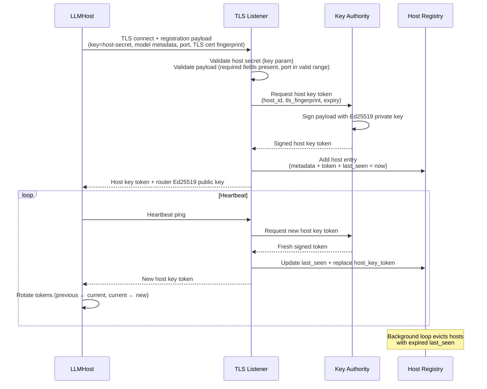
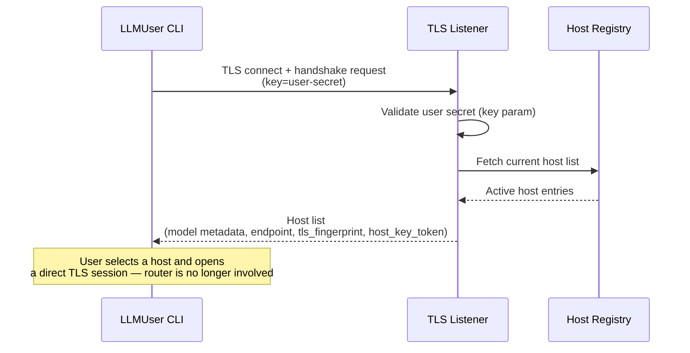

# LLMRouter — Component Architecture

> **Scope:** Phase 1 (MVP). See [`architecture_overview.md`](./architecture_overview.md) for system-wide context, security model, and the phase roadmap.

---

## 1. Responsibilities (Phase 1)

The LLMRouter has three distinct concerns that must be kept architecturally separate:

1. **Registry authority** — maintain a live, in-memory registry of active LLMHosts; evict stale entries automatically.
2. **Key issuance** — be the sole trust anchor for the network; sign host key tokens that LLMUsers present to open sessions.
3. **Broker, not proxy** — facilitate the initial handshake, then step aside. The router never observes or relays inference traffic.

---

## 2. Internal Component Structure

The LLMRouter is a single, stateless process (stateless about conversation content; stateful about registrations). It exposes one TLS endpoint that both LLMHosts and LLMUsers connect to. It runs as a Docker container — this is a deployment convenience (dependency isolation, consistent launch pattern across the network), not a security requirement. Unlike LLMHost, the router runs no untrusted code, so extensive hardening is not necessary.

The router manages its own TLS certificate. On first startup it generates a self-signed cert and writes it to a fixed internal path (`/data/certs`). Subsequent startups load the existing cert — the fingerprint stays stable across `docker stop`/`docker start` cycles.

On every startup, the router also generates two random role credentials — a **host secret** and a **user secret** — held in memory only. These are embedded as a `key` query parameter in two separate sets of URLs printed at startup (see §7): **host registration URLs** for distribution to host operators, and **user access URLs** for distribution to end users. The router validates the `key` on every incoming connection before routing it to the host registration or user host-list handler; a connection presenting the user secret cannot trigger the host registration path.


### 2.1 TLS Listener

The single inbound endpoint for the network. Responsibilities:

- Accept TLS connections from both LLMHosts (registration + heartbeat) and LLMUsers (handshake + host list request).
- Demux the connection type from the initial message and route to the appropriate handler.
- Enforce that all connections present valid TLS; reject any plaintext or self-signed connections that do not match the expected fingerprint.
- Return errors fast — reject, close, and log; no partial state is written on failure.

### 2.2 Key Authority

Owns the router's Ed25519 signing key and the two role credentials — the combined trust anchor for the network. Responsibilities:

- Hold the Ed25519 private key in memory only. It is never written to disk.
- On startup, generate a **host secret** and a **user secret** — cryptographically random strings held in memory only. These are embedded in the host registration URLs and user access URLs respectively (see §7).
- On every incoming TLS connection, validate the `key` query parameter presented by the connecting party against the appropriate secret before the TLS Listener routes the connection to a handler. Connections with no `key`, an incorrect `key`, or a `key` that belongs to the wrong role are rejected immediately with no partial state written.
- On host registration, issue a **host key token**: a signed payload containing the host identifier, the host's TLS cert fingerprint, and an expiry timestamp.
- On each heartbeat, re-issue a fresh host key token with a new expiry and return it in the heartbeat response. The Host Registry is updated with the new token immediately.
- Expose the corresponding **Ed25519 public key** to outbound responses so that LLMHosts can verify tokens presented by LLMUsers.
- Have no external interface; only the TLS Listener may invoke it.

> On router restart, the Ed25519 private key and both role secrets are gone. All previously issued host key tokens are immediately invalid. Both URLs must be redistributed. All hosts must re-register and all users must reconnect. This is intentional: no stale credentials survive a router restart.

### 2.3 Host Registry

An in-memory map of currently active LLMHosts. Each entry holds:

| Field | Description |
|-------|-------------|
| `host_id` | Opaque identifier assigned at registration |
| `model_name` | Human-readable model name, as reported by the host |
| `context_size` | Context window size in tokens |
| `endpoint` | Host address + port for direct LLMUser connections |
| `tls_fingerprint` | TLS cert fingerprint for LLMUser cert pinning |
| `host_key_token` | The current signed token issued by the Key Authority; refreshed on every heartbeat |
| `last_seen` | Timestamp of the most recent heartbeat |

Responsibilities:

- Add an entry on successful host registration.
- On each heartbeat: update `last_seen` and replace `host_key_token` with the newly issued token.
- Run a background eviction loop: remove any host whose `last_seen` exceeds the configured heartbeat timeout. An evicted host is immediately absent from the host list returned to LLMUsers.
- Return the full host list (all non-evicted entries) on request.

> The registry always holds only the *current* token per host. The LLMHost is responsible for retaining the previous token during the overlap window (see §4.3).

---

## 3. Connection Flows

### 3.1 LLMHost Registration

For the full registration flow in system context, see [`architecture_overview.md`](./architecture_overview.md) §4.1. The router-side view:



### 3.2 LLMUser Handshake



---

## 4. Security Design

### 4.1 Key Authority — Ed25519 Key Storage

The router's Ed25519 private key is held in process memory only and is never written to disk or passed to any other process. Consequences are the same as for LLMHost key storage: a router restart invalidates all previously issued host key tokens. Hosts must re-register; users must reconnect.

The router's **public key** is distributed to LLMHosts as part of the registration response. LLMHosts use it to verify the host key token that a LLMUser presents when opening a session. The public key may also be pre-configured out-of-band as a trust anchor.

### 4.2 Host Key Token Format

The host key token is an Ed25519-signed payload. The signed content includes:

| Field | Purpose |
|-------|---------|
| `hostId` | Ties the token to a specific host; LLMHost rejects tokens issued for a different host |
| `tlsFingerprint` | The host's TLS cert fingerprint; LLMUser pins to this before presenting the token |
| `expiresAt` | Unix epoch milliseconds; LLMHost rejects expired tokens |

#### Wire format

The token is serialized as a dot-separated two-part string:

```
base64url(JSON.stringify(payload)) + "." + base64url(ed25519_signature)
```

Example payload (before encoding):

```json
{ "hostId": "host_abc123", "tlsFingerprint": "sha256:a3f1c2...", "expiresAt": 1716148800000 }
```

The signature is computed over the base64url-encoded payload string (the first part), not over the raw JSON.

The token is opaque to both the LLMHost and LLMUser. Its only valid use is presentation — the LLMHost verifies the signature and fields; it does not parse or act on the payload content beyond that. See also [`architecture_overview.md`](./architecture_overview.md) §9 (Router-issued host keys).

### 4.3 Token Refresh and Overlap Window

Host key tokens have a short TTL of `2 × heartbeat_interval` (≈60–90s with default settings). The router re-issues a fresh token on every heartbeat and updates the Host Registry immediately, so LLMUsers always receive a current token when they fetch the host list.

This creates a narrow race condition: a user who receives a token and then takes a moment to select and connect to a host may arrive at the LLMHost holding a token that was valid when fetched but has since been replaced. To handle this without requiring the LLMUser to retry, the LLMHost maintains an **overlap window**:

- The Router Client keeps both the **current token** (just received) and the **previous token** (from the prior heartbeat cycle).
- The Session Manager accepts either token during the overlap window.
- The previous token is cleared after a fixed grace period of **60 seconds**, after which only the current token is accepted.

```
heartbeat N:   current = token_N,   previous = token_N-1  (valid for 60s)
heartbeat N+1: current = token_N+1, previous = token_N    (valid for 60s)
```

A user who fetches the host list and connects within the overlap window always succeeds. A user holding a token older than one heartbeat cycle plus the grace period is rejected — they must re-fetch the host list.

The overlap window state (current + previous token, grace period timer) lives entirely on the LLMHost. The router has no awareness of it.

### 4.4 Trust Boundary

The router is a trusted coordinator. It does not observe inference traffic, which limits its exposure to conversation data. Its main attack surface is the TLS listener and the Key Authority's private key.

The router is also the **network entry gatekeeper** for the closed group. It cannot verify the Docker image contents of a registering LLMHost — it authenticates the TLS connection and issues a host key, but has no mechanism to attest what software is running inside the container. This is by design: trust in registered hosts is rooted in possession of the host registration URL, which the group administrator distributes out-of-band only to trusted operators. The router enforces who is *admitted* to the network; it does not and cannot enforce what admitted participants *run*.

The **two-URL role split** provides an additional enforcement layer: a party who holds only the user access URL cannot register a host, because the router validates the `key` parameter against the host secret before admitting any connection to the registration path. This means a user (e.g. a student) cannot escalate to host role even if they know the router's address — they would need the host secret embedded in the host registration URL, which they were never given.

**Both URLs are sensitive credentials.** The administrator must distribute each only to the appropriate role through trusted channels (e.g. a private message, a shared internal wiki, direct communication). A leak of the host URL is a potential compromise of host registration access; a leak of the user URL is a potential compromise of user access. Either should be treated as requiring a router restart and URL redistribution.

See [`architecture_overview.md`](./architecture_overview.md) §5 for the full system trust boundary, including the treatment of malicious host operators and the closed-network design rationale.

---

## 5. Failure Handling

| Failure | Response |
|---------|----------|
| LLMHost stops heartbeating | Host Registry evicts the entry after the timeout. Host disappears from the list returned to new LLMUser handshakes. No active user sessions are affected — they are direct. |
| LLMHost reconnects after eviction | Treated as a new registration. Key Authority issues a new host key token. Previous token is invalid (different `host_id` or expired). |
| Router restarts | All registry state is lost. All previously issued host key tokens are invalid (new Ed25519 key generated). All hosts must re-register. All users must reconnect. |
| Key Authority unavailable (e.g. memory pressure) | Host registration is rejected. No partial state is written. The host retries with backoff per its Router Client logic. |

---

## 6. Configuration

The router is configured via environment variables on startup.

| Variable | Required | Description | Example |
|----------|:--------:|-------------|---------|
| `SHAREGRID_LISTEN_ADDR` | Yes | Address and port the TLS Listener binds to | `0.0.0.0:8443` |
| `SHAREGRID_HEARTBEAT_TIMEOUT` | No | Seconds before a host with no heartbeat is evicted. Default: `90` | `90` |

The TLS certificate and private key are managed internally. They are stored at a fixed path inside the container (`/data/certs/router.crt` and `/data/certs/router.key`). No operator-supplied cert configuration is needed or accepted.

If any required variable is absent, the router must exit immediately with a clear error rather than starting in a partially configured state.

### 6.1 Docker Deployment

The router is packaged and distributed as a Docker image. A minimal `docker run` invocation:

```
docker run \
  -p 8443:8443 \
  -e SHAREGRID_LISTEN_ADDR=0.0.0.0:8443 \
  registry/llmrouter@sha256:<digest>
```

The router generates a self-signed TLS cert on first startup and writes it to `/data/certs` inside the container. No volume mount is required.

**Restart behaviour:** `docker stop`/`docker start` preserves the container's writable layer, so the cert and fingerprint survive across those restarts. Removing and recreating the container (e.g. on an image update) generates a new cert and a new fingerprint — the connection URL must be redistributed. This is consistent with the existing disruption of a full container recreation: the Ed25519 key is also lost, requiring all hosts to re-register and all users to reconnect.

Unlike LLMHost, no paranoid hardening flags are required. Standard practice applies: run as a non-root user, publish only the listen port, use a digest-pinned image reference.

---

## 7. Startup Output

On successful startup, the router prints a summary to stdout. Its primary purpose is to give the operator the exact values to supply as `SHAREGRID_ROUTER_URL` when starting LLMHost and LLMUser nodes.

The router enumerates all non-loopback network interfaces and prints a candidate endpoint for each, using the configured port and the `https://` scheme. It also performs a best-effort public IP lookup so operators behind NAT do not need to determine their public IP manually.

Example output:

```
LLMRouter started.

  Listen address : 0.0.0.0:8443
  TLS fingerprint: sha256:a3f1c2d4e5b6...

  HOST REGISTRATION URLs — distribute only to trusted host operators:
    https://203.0.113.7:8443?fp=sha256:a3f1c2d4e5b6...&key=h-x9k2mQ...    [public]
    https://192.168.1.42:8443?fp=sha256:a3f1c2d4e5b6...&key=h-x9k2mQ...   [eth0]
    https://10.0.0.5:8443?fp=sha256:a3f1c2d4e5b6...&key=h-x9k2mQ...       [wlan0]

  USER ACCESS URLs — distribute only to end users:
    https://203.0.113.7:8443?fp=sha256:a3f1c2d4e5b6...&key=u-p7rNv4...    [public]
    https://192.168.1.42:8443?fp=sha256:a3f1c2d4e5b6...&key=u-p7rNv4...   [eth0]
    https://10.0.0.5:8443?fp=sha256:a3f1c2d4e5b6...&key=u-p7rNv4...       [wlan0]

  Set SHAREGRID_ROUTER_URL on each LLMHost to a HOST REGISTRATION URL.
  Set SHAREGRID_ROUTER_URL on each LLMUser to a USER ACCESS URL.
```

Notes:
- The `fp` query parameter contains the SHA-256 fingerprint of the router's TLS certificate. Clients parse it from the URL and pin the TLS connection to it — no separate cert distribution is needed.
- The `key` query parameter is the role-specific secret. The router validates it on every connection before routing to the host registration or user host-list handler. A user presenting a user `key` cannot reach the host registration path.
- **Both URLs are sensitive credentials.** The administrator must distribute each only to the appropriate role through trusted channels. A leak of either URL should be treated as a compromise requiring a router restart and full URL redistribution. See §4.4.
- Loopback addresses (`127.0.0.1`, `::1`) are excluded — they are not reachable from other machines.
- If no non-loopback interface is found, the router logs a warning and prints the raw listen address so the operator can still determine the correct value manually.
- The public IP is resolved at startup by querying a public IP reflection service (e.g. `https://api.ipify.org`). If the lookup fails or times out, the `[public]` line is omitted and a warning is printed — this is non-fatal. The router starts regardless.
- The output is printed once at startup and not repeated. It is not part of the ongoing log stream.

---

## 8. Phase Roadmap — LLMRouter Impact

| Phase | Change | What it means for LLMRouter |
|-------|--------|-----------------------------|
| **1** | MVP | Architecture described in this document. |
| **2** | Structured tool-call responses on the host side | No router changes required. The User ↔ Host channel is direct. |
| **3** | Controlled internet access for LLMHost | No router changes required. Internet policy is enforced at the container level. |
| **4** | Multiple simultaneous hosts and users; session reservation | Host Registry must track busy/free status per host. TLS Listener must handle host status update messages. User handshake response must surface host availability. |
| **Future** | Federation between independent trusted groups (e.g. inter-university, inter-department). Cross-group resource accounting. | Router-to-router peering with explicit trust grants between group administrators. Each group retains its own Key Authority and membership control. A shared or replicated Host Registry layer enables cross-group host discovery. Key Authority must support key rotation without invalidating all live tokens. |
