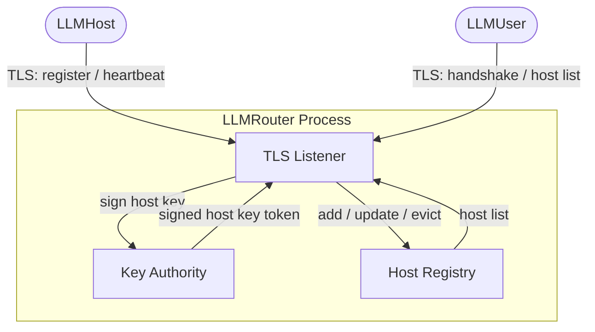
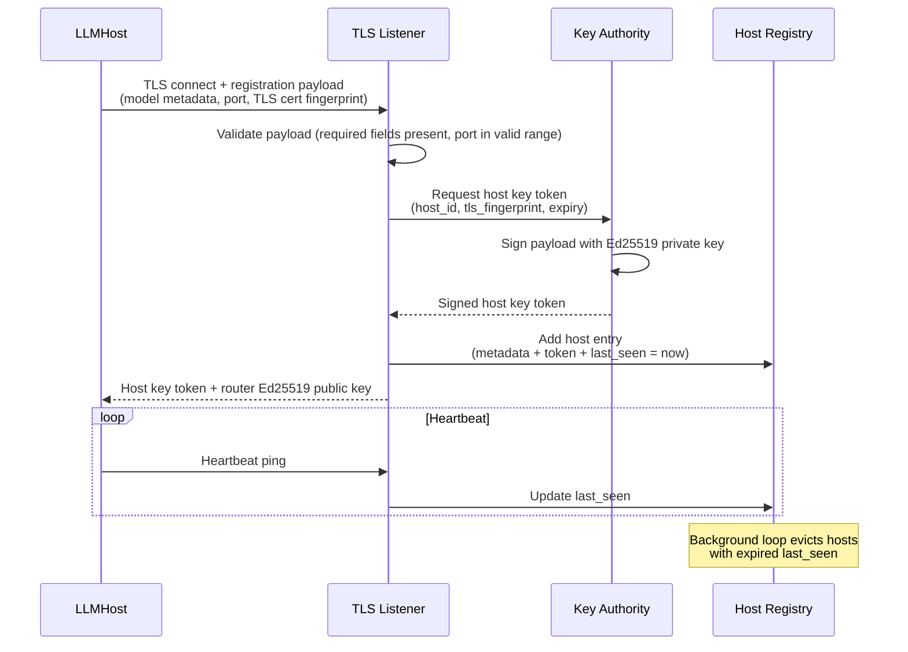
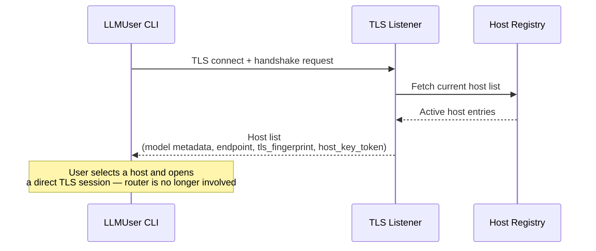

# LLMRouter — Component Architecture

> **Scope:** Phase 1 (MVP). See [`architecture_overview.md`](./architecture_overview.md) for system-wide context, security model, and the phase roadmap.

---

## 1. Responsibilities (Phase 1)

The LLMRouter has three distinct concerns that must be kept architecturally separate:

1. **Registry authority** — maintain a live, in-memory registry of active LLMHosts; evict stale entries automatically.
2. **Key issuance** — be the sole trust anchor for the network; sign host key tokens that LLMUsers present to open sessions.
3. **Broker, not proxy** — facilitate the initial handshake, then step aside. The router never observes or relays inference traffic.

---

## 2. Internal Component Structure

The LLMRouter is a single, stateless process (stateless about conversation content; stateful about registrations). It exposes one TLS endpoint that both LLMHosts and LLMUsers connect to.



### 2.1 TLS Listener

The single inbound endpoint for the network. Responsibilities:

- Accept TLS connections from both LLMHosts (registration + heartbeat) and LLMUsers (handshake + host list request).
- Demux the connection type from the initial message and route to the appropriate handler.
- Enforce that all connections present valid TLS; reject any plaintext or self-signed connections that do not match the expected fingerprint.
- Return errors fast — reject, close, and log; no partial state is written on failure.

### 2.2 Key Authority

Owns the router's Ed25519 signing key — the trust anchor for the entire network. Responsibilities:

- Hold the Ed25519 private key in memory only. It is never written to disk.
- On host registration, issue a **host key token**: a signed payload containing the host identifier, the host's TLS cert fingerprint, and an expiry timestamp.
- Expose the corresponding **Ed25519 public key** to outbound responses so that LLMHosts can verify tokens presented by LLMUsers.
- Have no external interface; only the TLS Listener may invoke it.

> On router restart, the private key is gone. All previously issued host key tokens are immediately invalid — their signature can no longer be verified against the new key. All hosts must re-register and all users must reconnect. This is intentional: no stale credentials survive a router restart.

### 2.3 Host Registry

An in-memory map of currently active LLMHosts. Each entry holds:

| Field | Description |
|-------|-------------|
| `host_id` | Opaque identifier assigned at registration |
| `model_name` | Human-readable model name, as reported by the host |
| `context_size` | Context window size in tokens |
| `endpoint` | Host address + port for direct LLMUser connections |
| `tls_fingerprint` | TLS cert fingerprint for LLMUser cert pinning |
| `host_key_token` | The signed token issued by the Key Authority |
| `last_seen` | Timestamp of the most recent heartbeat |

Responsibilities:

- Add an entry on successful host registration.
- Update `last_seen` on each heartbeat.
- Run a background eviction loop: remove any host whose `last_seen` exceeds the configured heartbeat timeout. An evicted host is immediately absent from the host list returned to LLMUsers.
- Return the full host list (all non-evicted entries) on request.

---

## 3. Connection Flows

### 3.1 LLMHost Registration

For the full registration flow in system context, see [`architecture_overview.md`](./architecture_overview.md) §4.1. The router-side view:



### 3.2 LLMUser Handshake



---

## 4. Security Design

### 4.1 Key Authority — Ed25519 Key Storage

The router's Ed25519 private key is held in process memory only and is never written to disk or passed to any other process. Consequences are the same as for LLMHost key storage: a router restart invalidates all previously issued host key tokens. Hosts must re-register; users must reconnect.

The router's **public key** is distributed to LLMHosts as part of the registration response. LLMHosts use it to verify the host key token that a LLMUser presents when opening a session. The public key may also be pre-configured out-of-band as a trust anchor.

### 4.2 Host Key Token Format

The host key token is an Ed25519-signed payload. The signed content includes:

| Field | Purpose |
|-------|---------|
| `host_id` | Ties the token to a specific host; LLMHost rejects tokens issued for a different host |
| `tls_fingerprint` | The host's TLS cert fingerprint; LLMUser pins to this before presenting the token |
| `expires_at` | UTC timestamp; LLMHost rejects expired tokens |

The token is opaque to both the LLMHost and LLMUser. Its only valid use is presentation — the LLMHost verifies the signature and fields; it does not parse or act on the payload content beyond that. See also [`architecture_overview.md`](./architecture_overview.md) §9 (Router-issued host keys).

### 4.3 Trust Boundary

The router is a trusted coordinator. It does not observe inference traffic, which limits its exposure to conversation data. Its main attack surface is the TLS listener and the Key Authority's private key.

See [`architecture_overview.md`](./architecture_overview.md) §5 for the full system trust boundary, including the treatment of malicious host operators.

---

## 5. Failure Handling

| Failure | Response |
|---------|----------|
| LLMHost stops heartbeating | Host Registry evicts the entry after the timeout. Host disappears from the list returned to new LLMUser handshakes. No active user sessions are affected — they are direct. |
| LLMHost reconnects after eviction | Treated as a new registration. Key Authority issues a new host key token. Previous token is invalid (different `host_id` or expired). |
| Router restarts | All registry state is lost. All previously issued host key tokens are invalid (new Ed25519 key generated). All hosts must re-register. All users must reconnect. |
| Key Authority unavailable (e.g. memory pressure) | Host registration is rejected. No partial state is written. The host retries with backoff per its Router Client logic. |

---

## 6. Configuration

The router is configured via environment variables on startup.

| Variable | Required | Description | Example |
|----------|:--------:|-------------|---------|
| `SHAREGRID_LISTEN_ADDR` | Yes | Address and port the TLS Listener binds to | `0.0.0.0:8443` |
| `SHAREGRID_TLS_CERT` | Yes | Path to the router's TLS certificate | `/etc/sharegrid/router.crt` |
| `SHAREGRID_TLS_KEY` | Yes | Path to the router's TLS private key | `/etc/sharegrid/router.key` |
| `SHAREGRID_HEARTBEAT_TIMEOUT` | No | Seconds before a host with no heartbeat is evicted. Default: `90` | `90` |

If any required variable is absent, the router must exit immediately with a clear error rather than starting in a partially configured state.

---

## 7. Startup Output

On successful startup, the router prints a summary to stdout. Its primary purpose is to give the operator the exact values to supply as `SHAREGRID_ROUTER_URL` when starting LLMHost and LLMUser nodes.

The router enumerates all non-loopback network interfaces and prints a candidate endpoint for each, using the configured port and the `https://` scheme. It also performs a best-effort public IP lookup so operators behind NAT do not need to determine their public IP manually.

Example output:

```
LLMRouter started.

  Listen address : 0.0.0.0:8443

  Reachable endpoints (use as SHAREGRID_ROUTER_URL):
    https://203.0.113.7:8443    [public]
    https://192.168.1.42:8443   [eth0]
    https://10.0.0.5:8443       [wlan0]

  Copy one of the above into SHAREGRID_ROUTER_URL on each LLMHost and LLMUser.
```

Notes:
- Loopback addresses (`127.0.0.1`, `::1`) are excluded — they are not reachable from other machines.
- If no non-loopback interface is found, the router logs a warning and prints the raw listen address so the operator can still determine the correct value manually.
- The public IP is resolved at startup by querying a public IP reflection service (e.g. `https://api.ipify.org`). If the lookup fails or times out, the `[public]` line is omitted and a warning is printed — this is non-fatal. The router starts regardless.
- The output is printed once at startup and not repeated. It is not part of the ongoing log stream.

---

## 8. Phase Roadmap — LLMRouter Impact

| Phase | Change | What it means for LLMRouter |
|-------|--------|-----------------------------|
| **1** | MVP | Architecture described in this document. |
| **2** | Structured tool-call responses on the host side | No router changes required. The User ↔ Host channel is direct. |
| **3** | Controlled internet access for LLMHost | No router changes required. Internet policy is enforced at the container level. |
| **4** | Multiple simultaneous hosts and users; session reservation | Host Registry must track busy/free status per host. TLS Listener must handle host status update messages. User handshake response must surface host availability. |
| **Future** | Multiple routers, load balancing, resource accounting | Router becomes a distributed or federated service. Host Registry needs a shared backing store. Key Authority must support key rotation without invalidating all live tokens. |

---

## 9. Open Design Decisions

| # | Question | Status | Notes |
|---|----------|--------|-------|
| 1 | **Host key token TTL** | Open | Must be long enough to survive a slow handshake; short enough to limit the window for a stolen token. A starting point: 5 minutes from issuance. |
| 2 | **Heartbeat eviction timeout** | Open | Must be longer than the configured heartbeat interval on the LLMHost side (default 30 s). Starting point: `3 × heartbeat_interval`. |
| 3 | **Ed25519 key provisioning** | Open | Phase 1: generated fresh on each router startup (simplest; consequences documented in §4.1). Alternative: load from a file to survive restarts. Tradeoff: persistent key increases impact of key compromise. |
