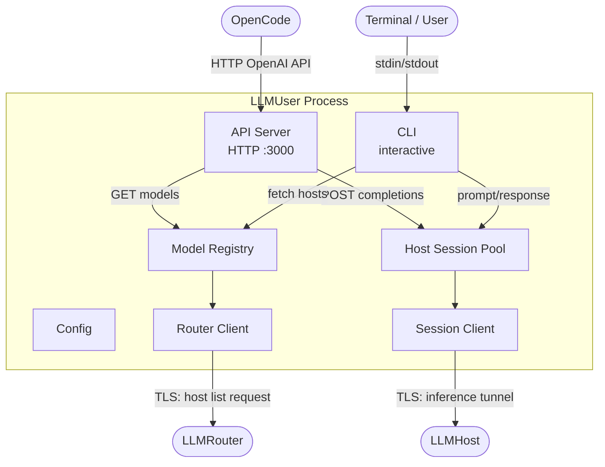
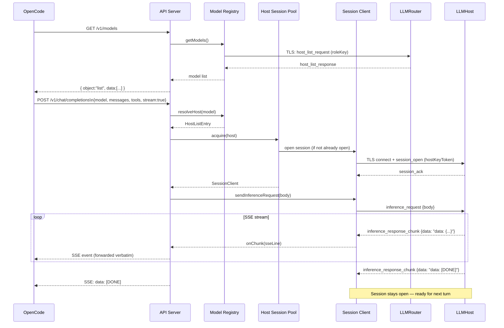
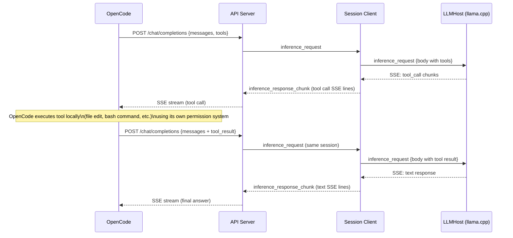

# LLMUser — Component Architecture

> **Scope:** Phase 1 (MVP), Phase 2 (OpenCode provider integration), and Phase 3 (availability-aware host selection + multi-session pool). See [`architecture_overview.md`](./architecture_overview.md) for system-wide context, security model, and the phase roadmap.

---

## 1. Responsibilities

The LLMUser has three concerns:

1. **Discovery** — connect to the configured LLMRouter and retrieve the current list of available hosts and their model metadata.
2. **Session** — open a direct, authenticated TLS channel to a chosen LLMHost and tunnel inference traffic between the caller and the host.
3. **Interface** — expose the above in one of two modes:
   - **HTTP server mode** (default, Phase 2): an OpenAI-compatible local HTTP server that OpenCode treats as a standard provider.
   - **CLI mode** (optional): an interactive terminal session for standalone use without OpenCode.

---

## 2. Internal Component Structure



### 2.1 Router Client

Handles the single connection to the LLMRouter made at startup (or on demand). Responsibilities:

- Parse the `fp` and `key` query parameters from `SHAREGRID_ROUTER_URL`. `SHAREGRID_ROUTER_URL` must be the **user access URL** (containing the user-specific `key`); it cannot register a host.
- Pin the TLS connection to the `fp` fingerprint when connecting to the router.
- Present the user `key` to the router; the router validates it before returning the host list.
- Return the host list and close the router connection — the router is not involved after this point.

### 2.2 Model Registry

A thin caching layer over the Router Client. Responsibilities:

- Call `RouterClient.fetchHostList()` to obtain the current list of active hosts.
- Map each `HostListEntry` to an OpenAI-format model object:
  - `id`: the `modelName` from the host (e.g. `Phi-3.5-mini-instruct-IQ2_M`)
  - `owned_by`: `"sharegrid"`
  - `context_length`: the `contextSize` reported by the host at registration
  - `sharegrid_available_slots`: sum of `availableSlots` across all hosts carrying this model
  - `sharegrid_total_slots`: sum of `totalSlots` across all hosts carrying this model
- Maintain a short-TTL cache (default 30 s) to avoid querying the router on every `GET /v1/models` call.
- Expose `resolveHost(modelId) → HostListEntry` — returns the first host with `availableSlots > 0`, falling back to any host if none are available. Used by the CLI.
- **(Phase 3)** Expose `resolveHosts(modelId) → HostListEntry[]` — returns all hosts carrying the model, sorted so hosts with `availableSlots > 0` appear first. Used by the API Server for its retry loop (see §2.5).

### 2.3 Host Session Pool

Manages persistent TLS sessions to LLMHosts. Responsibilities:

- **(Phase 3)** Maintain a list of `SessionClient` instances per `hostId` (was: at most one).
- `acquire(host: HostListEntry): Promise<SessionClient>` — implements **conversation affinity**:
  1. Prune dead sessions from the list (`isAlive() === false`).
  2. Return the first session that is both alive and not currently performing inference (`isInferenceActive() === false`). This is the "same session" guarantee for sequential conversations — between turns, the session is always idle and is always returned first.
  3. If no idle session exists (all alive sessions are currently inferring, i.e. concurrent conversations), open a new one: send `session_open`, wait for `session_ack`. A `session_reject: busy` from the host (all slots full) propagates as `HostBusyError`.
  4. Add the new session to the list and return it.
- On socket error or unexpected close: mark the session as dead; it is pruned on the next `acquire` call.
- Sessions stay open between inference turns for the lifetime of the process — this is the persistent session model that makes multi-turn conversations efficient and enables llama.cpp KV cache prefix reuse.

**`SessionClient.isInferenceActive()`** — new Phase 3 method. Returns `true` while a `sendInferenceRequest` promise is pending; `false` otherwise. Used by the pool to distinguish idle sessions from in-use sessions.

### 2.4 Session Client

Handles one TLS connection to a single LLMHost. Responsibilities:

- Open a TLS connection to the host endpoint, pinning to the TLS cert fingerprint received from the router. The `endpoint` is a `host:port` authority that may be an IPv6 bracketed literal (`[2001:db8::1]:9000`) in internet mode; it is split with the shared endpoint parser, which strips the brackets before dialling.
- Present the host key token in a `session_open` message; handle `session_ack` / `session_reject`.
- **Phase 2 inference protocol:**
  - Send `inference_request` messages carrying the full OpenAI request body as a JSON string.
  - Receive `inference_response_chunk` messages carrying raw SSE lines from the host; emit them to the caller.
  - Detect `data: [DONE]` as the end-of-inference signal.
- Expose an `abort()` method that destroys the TLS socket — the host Session Manager detects the close, aborts the in-flight inference, and flushes the llama.cpp slot.
- Send `session_close` on graceful teardown.

### 2.5 API Server (HTTP server mode)

An HTTP server exposing an OpenAI-compatible API. Binds to `0.0.0.0` inside the Docker container; external exposure is restricted to `127.0.0.1` by the Docker port mapping (`-p 127.0.0.1:<port>:<port>`), so the server remains inaccessible from the network. Responsibilities:

#### `GET /v1/models`

- Calls `ModelRegistry.getModels()`.
- Returns an OpenAI-format model list: `{ object: "list", data: [{ id, object: "model", owned_by: "sharegrid" }, ...] }`.

#### `POST /v1/chat/completions`

- Parses the request body; extracts `model`.
- **(Phase 3)** Calls `ModelRegistry.resolveHosts(model)` to get the ordered host list (available hosts first).
- **(Phase 3)** Iterates the list: for each host, calls `HostSessionPool.acquire(host)`; on `HostBusyError` continues to the next host; on any other error or after exhausting all hosts, returns 503.
- Forces `stream: true` in the request body (OpenCode always streams; non-streaming is not supported).
- Sends the request body as an `inference_request` message through the acquired session.
- Pipes each `inference_response_chunk.data` line back to the HTTP client as an SSE event, forwarding the raw llama.cpp SSE output verbatim.
- On HTTP client disconnect (e.g. OpenCode cancels): calls `session.abort()`.
- Returns HTTP 503 if all hosts for the requested model are busy.

**Authentication:** No API key is required — the server binds to localhost only. The ShareGrid credentials (`SHAREGRID_ROUTER_URL`) live in the adapter's environment, invisible to OpenCode.

**OpenCode configuration snippet** (printed by `start-dev.sh --server` and by the server at startup):

```json
{
  "provider": {
    "sharegrid": {
      "npm": "@ai-sdk/openai-compatible",
      "name": "ShareGrid",
      "options": { "baseURL": "http://localhost:3000/v1" }
    }
  }
}
```

### 2.6 CLI (CLI mode)

The interactive terminal interface for standalone use without OpenCode. Responsibilities:

- On startup: fetch the host list via `ModelRegistry`, display available models, prompt the user to select one.
- Open a session to the selected host via `HostSessionPool`.
- Accept user input as prompts; construct a minimal OpenAI request body (`{ messages, stream: true }`) with no tool definitions.
- Send the request via `SessionClient.sendInferenceRequest()`; receive `inference_response_chunk` messages.
- Parse each raw SSE line from `inference_response_chunk.data` to extract `choices[0].delta.content` for display. Tool-call chunks are noted briefly (`[tool call]`) but not executed.
- Ctrl+C during generation: calls `sessionClient.abort()` to cancel the in-flight inference; session stays open for the next prompt.
- Ctrl+C at the input prompt: sends `session_close` and exits.
- On errors (host busy, connection failure, idle timeout): display a clear message and offer to re-select a host.

### 2.7 Configuration

| Variable | Required | Default | Description |
|----------|:--------:|---------|-------------|
| `SHAREGRID_ROUTER_URL` | Yes | — | **User access URL** for this network. Contains both the `fp` fingerprint and the user-specific `key`. | 
| `SHAREGRID_LISTEN_PORT` | No | `3000` | Port for the HTTP server (server mode only). |
| `SHAREGRID_MODE` | No | `server` | Operating mode: `server` (HTTP provider adapter) or `cli` (interactive terminal). |

If `SHAREGRID_ROUTER_URL` is absent, the process exits immediately with a clear error.

---

## 3. Flows

### 3.1 OpenCode Provider Flow (server mode)



### 3.2 Multi-Turn Conversation (tool calls)



### 3.3 CLI Flow (CLI mode)

```mermaid
sequenceDiagram
    participant User
    participant CLI
    participant MR as Model Registry
    participant HSP as Host Session Pool
    participant SC as Session Client
    participant R as LLMRouter
    participant H as LLMHost

    CLI->>MR: getModels()
    MR->>R: host_list_request
    R-->>MR: host_list_response
    MR-->>CLI: model list
    CLI->>User: Display models
    User->>CLI: Select model

    CLI->>HSP: acquire(host)
    HSP->>SC: open session
    SC->>H: session_open (hostKeyToken)
    H-->>SC: session_ack

    loop Conversation
        User->>CLI: Prompt
        CLI->>SC: inference_request {messages, stream:true}
        SC->>H: inference_request
        H-->>SC: inference_response_chunk stream
        SC-->>CLI: raw SSE lines
        CLI->>CLI: parse delta.content from SSE
        CLI->>User: Display response text

        opt Ctrl+C during generation
            CLI->>SC: abort()
            SC->>H: socket close
            Note over CLI: Partial response discarded;\nloop continues
        end
    end

    User->>CLI: Ctrl+C at prompt
    CLI->>SC: session_close
```

---

## 4. Security Design

### 4.1 TLS Cert Pinning

The LLMUser adapter pins the TLS connection to the LLMHost using the cert fingerprint received from the router. This prevents a man-in-the-middle from impersonating a legitimate host.

### 4.2 Host Key Token

The host key token received from the router is presented verbatim to the LLMHost as a session credential. The adapter does not parse or interpret it. The LLMHost verifies the token's signature and freshness; see [`architecture_llmhost.md`](./architecture_llmhost.md) §5.2.

### 4.3 Localhost-Only HTTP Server

The API Server binds to `0.0.0.0` inside the Docker container, but Docker publishes the port only on the host's `127.0.0.1` (via `-p 127.0.0.1:<port>:<port>`). It is not accessible from the network. OpenCode connects from the same machine. The ShareGrid `SHAREGRID_ROUTER_URL` (which embeds the secret `key`) is held in the adapter's environment — it is not exposed through the HTTP API.

### 4.4 Tool Execution and the Perimeter

In server mode, the LLMUser adapter is a transparent proxy. It does not execute, inspect, modify, or restrict tool calls or tool results. This is intentional: tool execution is OpenCode's responsibility.

The **execution perimeter** is defined entirely in the user's `opencode.json` via OpenCode's `permission` setting:

```json
{
  "permission": {
    "write": "ask",
    "edit": "ask",
    "bash": "deny"
  }
}
```

OpenCode enforces file-system scope (working directory) and permission gates before executing any tool call — regardless of what the LLM returns. A malicious or misconfigured LLM cannot bypass this because the tool execution path runs in OpenCode, outside ShareGrid entirely.

### 4.5 No Persistent State

The LLMUser adapter holds no state between process restarts. No conversation history, credentials, or host keys are written to disk. On process exit, the Host Session Pool is torn down gracefully (session_close sent to each open session).

### 4.6 Role Separation

The user access URL contains a user-specific `key` credential that is distinct from the host registration `key`. The router validates this credential and gates it exclusively to the host-list path — a connection presenting the user `key` cannot trigger host registration. See [`architecture_overview.md`](./architecture_overview.md) §5.

---

## 5. Failure Handling

| Failure | Response |
|---------|----------|
| Router unreachable | Exit (CLI) or return 503 (server); log error. |
| No hosts available | CLI: inform user and exit. Server: `GET /v1/models` returns empty list; `POST /chat/completions` returns 404. |
| Host connection fails | Mark session dead in pool; return 503; re-attempt on next request. |
| Host busy (slot occupied) | `session_reject` → HTTP 503 with `Retry-After` header. |
| Host key token rejected (expired) | Re-fetch host list; retry once with new token. |
| Session idle timeout (host closes) | Session marked dead in pool; user notified (CLI) or next request re-opens (server). |
| OpenCode cancels request (HTTP disconnect) | `session.abort()` called; host aborts inference and flushes KV cache; session marked dead. |

---

## 6. Phase Roadmap — LLMUser Impact

| Phase | Change | What it means for LLMUser |
|-------|--------|---------------------------|
| **1** | MVP | CLI only. Single prompt/response per turn. Phase 1 protocol types. |
| **2** | OpenCode provider integration | Redesigned as dual-mode service: HTTP server (default) + CLI. New `InferenceRequestPayload` / `InferenceResponseChunk` protocol. Model Registry, Host Session Pool, API Server added. Phase 1 protocol types removed. |
| **3** | Multiple hosts and users | `SessionClient` gains `isInferenceActive()`. Model Registry: `resolveHosts()` returns all hosts sorted available-first; `getModels()` aggregates `sharegrid_available_slots`, `sharegrid_total_slots`, `context_length` across hosts per model. Host Session Pool: `Map<hostId, SessionClient[]>` with conversation-affinity acquire. API Server: iterates host list with `HostBusyError` retry; surfaces slot metadata in `/v1/models`. |
| **Future** | Resource accounting, model-selection assistant | Usage tracking; automatic model selection before connecting. |
