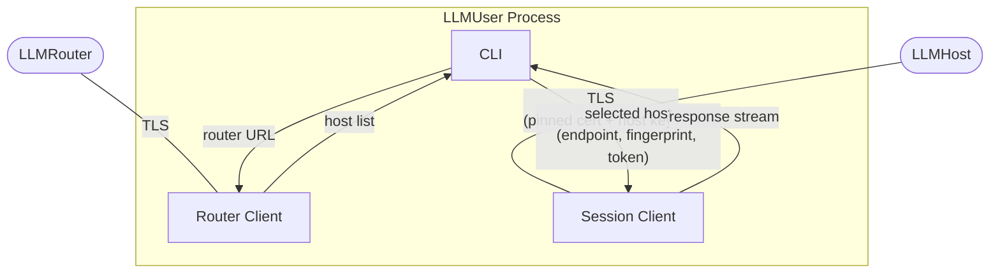
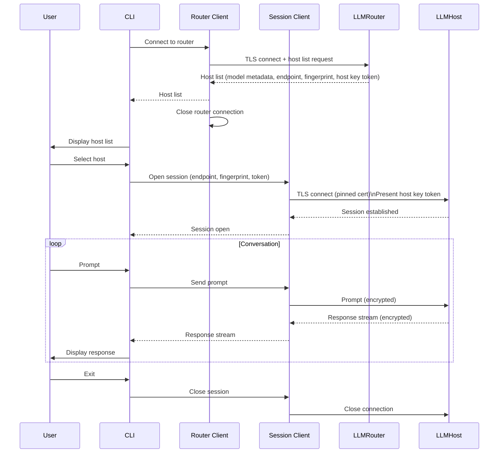

# LLMUser — Component Architecture

> **Scope:** Phase 1 (MVP). See [`architecture_overview.md`](./architecture_overview.md) for system-wide context, security model, and the phase roadmap.

---

## 1. Responsibilities (Phase 1)

The LLMUser has three concerns:

1. **Discovery** — connect to the configured LLMRouter and retrieve the current list of available hosts.
2. **Session** — open a direct, authenticated TLS channel to a chosen LLMHost and exchange prompts and responses.
3. **Interface** — present the above to the user as a CLI. No GUI, no local file I/O, no command execution in Phase 1.

---

## 2. Internal Component Structure

### 2.1 Router Client

Handles the connection to the LLMRouter. Responsibilities:

- Parse the `fp` query parameter from `SHAREGRID_ROUTER_URL` and pin the TLS connection to that fingerprint when connecting to the router.
- Establish a TLS connection to the configured router endpoint.
- Request the host list and return it to the CLI.
- Close the router connection once the host list is received — the router is not involved after this point.

### 2.2 Session Client

Handles the direct connection to a selected LLMHost. Responsibilities:

- Open a TLS connection to the host endpoint, pinning to the TLS cert fingerprint received from the router.
- Present the host key token as a session credential.
- Send prompts and stream responses back to the CLI.
- Close the connection on user exit or on receiving a session error (timeout, host rejection).

### 2.3 CLI

The user-facing interface. Responsibilities:

- On startup: display the host list (model name, context size, endpoint) and prompt the user to select a host.
- Once a session is open: accept user input as prompts and display streamed responses.
- On session errors (host busy, connection failure, idle timeout): display a clear message and return to the host list or exit.
- Apply no transformation to prompt or response content — it is a transparent pipe to the Session Client.

### 2.4 Configuration

| Variable | Required | Description | Example |
|----------|:--------:|-------------|---------|
| `SHAREGRID_ROUTER_URL` | Yes | LLMRouter endpoint to connect to on startup | `https://router.example.com:8443` |

If the required variable is absent, the CLI must exit immediately with a clear error.

---

## 3. Session Flow

---

## 4. Security Design

### 4.1 TLS Cert Pinning

The LLMUser pins the TLS connection to the LLMHost using the cert fingerprint received from the router. This prevents a man-in-the-middle from impersonating a legitimate host. A connection whose certificate does not match the pinned fingerprint is rejected before the host key token is presented.

### 4.2 Host Key Token

The host key token received from the router is presented verbatim to the LLMHost as a session credential. The LLMUser does not parse or interpret it — it is opaque. The LLMHost verifies the token's signature and freshness; see [`architecture_llmhost.md`](./architecture_llmhost.md) §5.2.

If the token is rejected (e.g. it expired during host selection), the CLI informs the user and offers to re-fetch the host list.

### 4.3 Output Safety

In Phase 1, all host responses are treated as plain text and displayed as-is. No content is executed, written to disk, or interpreted as instructions. This eliminates the attack surface of a malicious host crafting a response that harms the user machine.

### 4.4 No Persistent State

The LLMUser holds no state between sessions. No conversation history, credentials, or host keys are written to disk. On exit, everything is gone.

---

## 5. Failure Handling

| Failure | Response |
|---------|----------|
| Router unreachable on startup | Exit with a clear error message. |
| No hosts available (empty host list) | Inform the user; exit. |
| Host connection fails (network error) | Inform the user; return to the host list. |
| Host busy (slot occupied) | Inform the user ("host is busy"); return to the host list. |
| Host key token rejected (expired) | Inform the user; offer to re-fetch the host list. |
| Session idle timeout (host closes connection) | Inform the user; return to the host list. |

---

## 6. Phase Roadmap — LLMUser Impact

| Phase | Change | What it means for LLMUser |
|-------|--------|---------------------------|
| **1** | MVP | Architecture described in this document. |
| **2** | Structured tool-call responses; sandboxed local execution | Session Client must parse typed payloads from the host. A sandboxed execution layer handles file writes and shell commands on the user machine. |
| **3** | Controlled internet access on the host side | No LLMUser changes required. |
| **4** | Multiple hosts and users; session reservation | CLI must surface host availability. Session Client must handle reservation responses and retry logic. |
| **Future** | Resource accounting, model-selection assistant | CLI may surface usage data or integrate a model-selection flow before connecting. |
