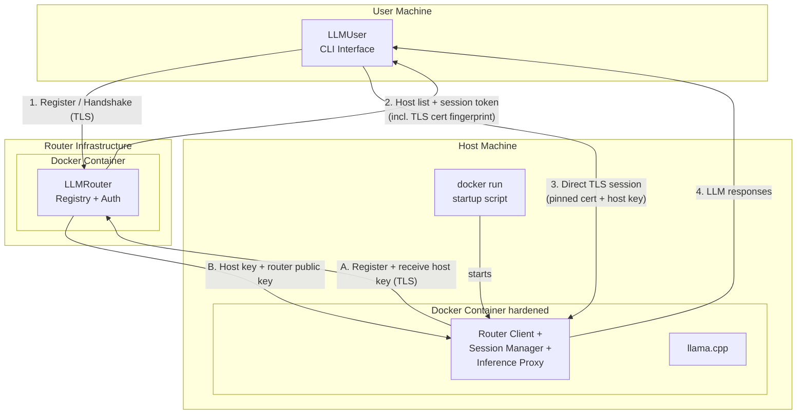
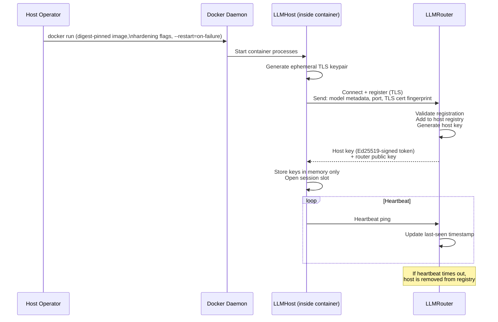
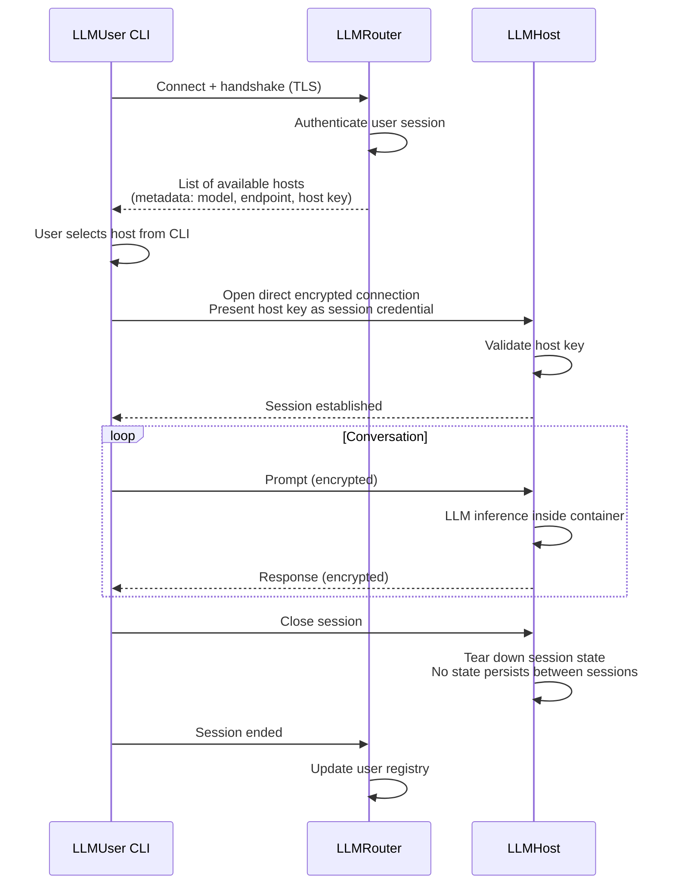
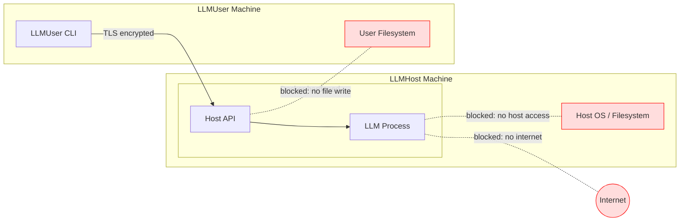

# ShareGrid — System Architecture Overview

> **Scope:** Phase 1 (MVP). Future-phase concerns are noted where they influence design decisions, but are not implemented in Phase 1.

---

## 1. Purpose

ShareGrid is a peer-to-peer compute-sharing network that allows participants to host and consume local LLM inference without relying on cloud providers. The system is designed around three roles: a router that coordinates the network, hosts that provide compute, and users that consume it.

---

## 2. Core Components

| Component | Role |
|-----------|------|
| **LLMRouter** | Network backbone. Maintains registries of active hosts and users. Issues authentication keys. Brokers initial connections. |
| **LLMHost** | Compute provider. Runs a local LLM inside a hardened Docker container. Accepts only router-authenticated sessions. |
| **LLMUser** | Consumer interface. CLI that queries the router for available hosts, then opens a direct encrypted channel to the chosen host. |

---

## 3. High-Level System Diagram

---

## 4. Registration and Session Flows

### 4.1 LLMHost Registration

### 4.2 LLMUser Session Flow

---

## 5. Security Model

Security is a first-class concern. The threat model covers both the host side (protecting the host machine from the LLM and from users) and the user side (protecting the user from a malicious host).

### 5.1 Trust Boundary

ShareGrid's security model protects against external and non-privileged threats. It has one explicit, inherent limitation:

**A LLMHost operator with root access to their own machine is a trusted participant.** Root can read process memory, attach a debugger to any running process, and intercept traffic before encryption is applied. No transport choice, container hardening measure, or encryption of internal channels can prevent a determined root-level attacker on the host machine from accessing conversation data.

This is not unique to ShareGrid — it is true of every cloud provider. A LLMUser is placing the same trust in a host operator as they would in a managed cloud service: a social and contractual trust, not a technical guarantee. **LLMUsers must understand that they are trusting the operator of the host they connect to.**

Hardware-level isolation (e.g. TEE/SGX enclaves) would be required to close this gap technically. That is out of scope for all current phases.

### 5.2 Threat Model Summary

| Threat | Mitigation |
|--------|------------|
| Malicious actor posing as a legitimate LLMHost | Router-issued Ed25519-signed host keys; hosts must re-register on reconnect |
| Eavesdropping on User ↔ Host traffic | All User ↔ Host communication is a direct, encrypted TLS channel |
| LLM or host process accessing the host machine | Hardened Docker container; no host networking, no host IPC, minimal capabilities |
| LLM output containing malware targeting the user | Phase 1: output is plain text only — no execution, no file writes on user machine |
| Information leaking between sessions on the same host | llama.cpp slot explicitly erased after each session; container restarted if erase fails |
| Host LLM used as internet proxy | Phase 1: no internet access configured in container |
| Non-root host process accessing the inference channel | Unix socket with `chmod 700`; no network port exposed for internal traffic |
| Malicious LLMHost operator (root) | Out of scope — see trust boundary above |

### 5.3 Security Architecture Diagram

### 5.4 Docker Hardening Requirements (Phase 1)

The Docker container running the LLMHost must be configured with:

- No volume mounts to the host filesystem
- No host network mode; one port published externally (Session Manager TLS listener only); all internal traffic uses a Unix socket inside the container
- No IPC sharing with host
- Drop all Linux capabilities not required for inference
- Read-only root filesystem where possible
- No privileged mode
- `--restart=on-failure` so Docker restarts the container on unexpected exit

---

## 6. Component Responsibilities (Phase 1)

### LLMRouter

- Runs as a Docker container; this is a deployment convenience (dependency isolation, consistent operator experience), not a security requirement — unlike LLMHost, the router runs no untrusted code
- Manages its own TLS certificate internally; the cert is written to a fixed path inside the container and its fingerprint is embedded in the connection URL the operator distributes
- Maintains an in-memory registry of connected LLMHosts and their metadata (model name, endpoint address, host key)
- Maintains an in-memory registry of active LLMUser sessions
- Issues signed host keys to LLMHosts on registration
- Authenticates LLMUsers and returns the current host list
- Removes hosts that stop heartbeating; removes users that become inactive
- Does **not** proxy or observe User ↔ Host traffic

### LLMHost

- Is a single Docker container; the host operator's only responsibility is running `docker run` with the correct hardening flags and digest-pinned image
- Generates an ephemeral TLS keypair on startup and registers with the configured LLMRouter
- Stores the router-issued host key in memory and enforces it on all incoming LLMUser connections
- Accepts one session at a time (Phase 1 constraint)
- Wipes all session state (llama.cpp KV cache) on session end; exits the container if the wipe cannot be confirmed

### LLMUser

- CLI interface; no GUI in Phase 1
- Connects to the configured LLMRouter on startup
- Presents the user with a list of available hosts and their model metadata
- Opens a direct TLS connection to the selected LLMHost
- Sends prompts and displays responses; no local file I/O or command execution in Phase 1

---

## 7. Data Flow Summary

---

## 8. Phase Roadmap — Architectural Impact

The following table summarises how later phases extend the architecture. These concerns shape some Phase 1 design decisions (e.g. keeping the router stateless about conversation content, and keeping the User ↔ Host channel independent of the router).

| Phase | Addition | Architectural Impact |
|-------|----------|----------------------|
| **1** | MVP: 1 host, 1 router, 1 user. CLI only. No internet. No execution. | Baseline architecture described in this document. |
| **2** | OpenCode provider integration. Local file/command execution on user machine with sandboxing. | LLMUser gains a sandboxed execution layer. Host responses may carry structured tool-call payloads. |
| **3** | Controlled internet access for LLMHost. | Docker container gains a filtered egress proxy. Router or a separate policy service controls allowed domains. |
| **4** | Multiple hosts and users. Session reservation (1 user per host per session). | Router gains session-state tracking and host-availability logic. Hosts must signal busy/free status. |
| **Future** | Multiple routers, load balancing, resource accounting, model-selection assistant. | Router becomes a distributed or federated service. Adds resource metering and request classification layers. |

---

## 9. Key Design Decisions and Rationale

**Direct User ↔ Host connection (no router proxy)**
The router only brokers the initial handshake. All inference traffic flows directly between user and host. This keeps the router lightweight and prevents it from becoming a bottleneck or a privacy risk as the network grows.

**Router-issued host keys**
Rather than a full PKI in Phase 1, the router issues a signed token to each host on registration. The user receives this token in the host list and presents it when opening a session. This allows the host to verify that the connecting user has been through the router without the router needing to be online during the session.

**Stateless session teardown**
The LLMHost destroys all session context after a session ends. This is a security requirement to prevent cross-session information leakage, and is foundational for Phase 4's multi-user model.

**CLI-only interface in Phase 1**
Removes the attack surface of a local web server or file system access. Phase 2 introduces execution capabilities, which will require their own sandboxing design.
