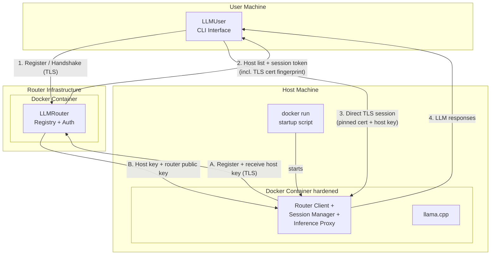
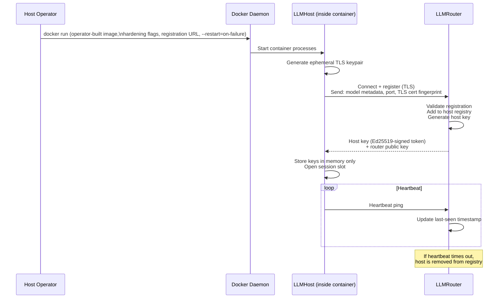
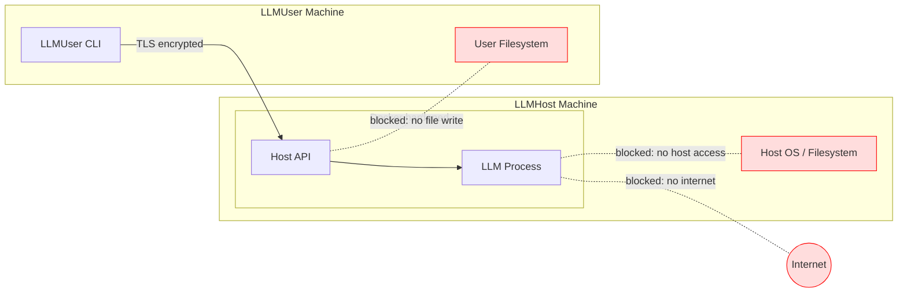
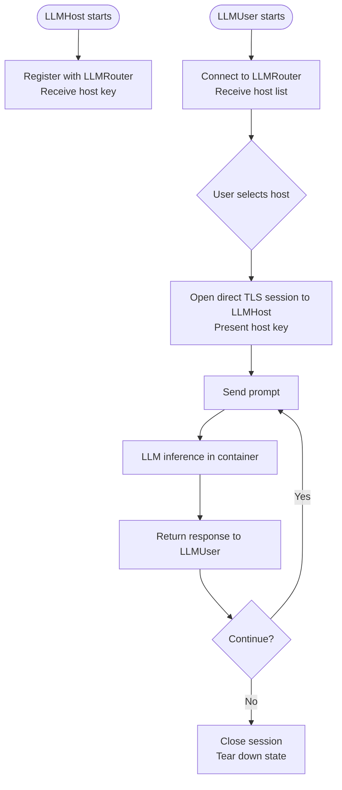

# ShareGrid — System Architecture Overview

> **Scope:** Phase 1 (MVP) and Phase 2 (OpenCode provider integration + tool-call execution). Future-phase concerns are noted where they influence design decisions, but are not implemented yet.

---

## 1. Purpose

ShareGrid is a peer-to-peer compute-sharing network for **closed groups of trusted actors** — such as a university computer cluster, a company's internal infrastructure, or a group of collaborating individuals. It allows participants within such a group to host and consume local LLM inference without relying on cloud providers.

ShareGrid is explicitly **not** designed as an open network where unknown or unvetted participants can join organically. Membership in a ShareGrid network is controlled out-of-band by a group administrator who runs an LLMRouter. The router generates two distinct URLs on startup — a **host registration URL** and a **user access URL** — each embedding a role-specific secret alongside the router's TLS certificate fingerprint. The administrator distributes each URL only to the parties who should hold that role: host operators receive the host URL, end users receive the user URL. Possessing the user URL does not grant the ability to register as a host, and vice versa.

The system is designed around three roles: a router that coordinates the network, hosts that provide compute, and users that consume it.

---

## 2. Core Components

| Component | Role |
|-----------|------|
| **LLMRouter** | Network backbone. Maintains registries of active hosts and users. Issues authentication keys. Brokers initial connections. |
| **LLMHost** | Compute provider. Runs a local LLM inside a hardened Docker container. Accepts only router-authenticated sessions. |
| **LLMUser** | Consumer interface. CLI that queries the router for available hosts, then opens a direct encrypted channel to the chosen host. |

---

## 3. High-Level System Diagram



---

## 4. Registration and Session Flows

### 4.1 LLMHost Registration



### 4.2 LLMUser Session Flow

```mermaid
sequenceDiagram
    participant U as LLMUser CLI
    participant R as LLMRouter
    participant H as LLMHost

    U->>R: Connect + handshake (TLS)
    R->>R: Authenticate user session
    R-->>U: List of available hosts<br/>(metadata: model, endpoint, host key)

    U->>U: User selects host from CLI

    U->>H: Open direct encrypted connection<br/>Present host key as session credential
    H->>H: Validate host key
    H-->>U: Session established

    loop Conversation
        U->>H: Prompt (encrypted)
        H->>H: LLM inference inside container
        H-->>U: Response (encrypted)

        opt User presses Ctrl+C during generation
            U->>H: prompt_cancel
            H->>H: Abort in-flight inference
            H-->>U: prompt_cancelled
            Note over U: Partial response discarded;<br/>session remains open
        end
    end

    U->>H: Close session
    H->>H: Tear down session state<br/>No state persists between sessions
    U->>R: Session ended
    R->>R: Update user registry
```

---

## 5. Security Model

Security is a first-class concern. The threat model covers both the host side (protecting the host machine from the LLM and from users) and the user side (protecting the user from a malicious host).

### 5.1 Trust Boundary

ShareGrid's security model protects against external and non-privileged threats within a closed, pre-trusted group. It has two explicit, inherent limitations:

**1. A LLMHost operator with root access to their own machine is a trusted participant.** Root can read process memory, attach a debugger to any running process, and intercept traffic before encryption is applied. No transport choice, container hardening measure, or encryption of internal channels can prevent a determined root-level attacker on the host machine from accessing conversation data.

This is not unique to ShareGrid — it is true of every cloud provider. A LLMUser is placing the same trust in a host operator as they would in a managed cloud service: a social and contractual trust, not a technical guarantee. **LLMUsers must understand that they are trusting the operator of the host they connect to.**

Hardware-level isolation (e.g. TEE/SGX enclaves) would be required to close this gap technically. That is out of scope for all current phases.

**2. The router cannot verify the content of the Docker image a LLMHost is running.** When a host registers, the router authenticates the connection and issues a host key, but it has no mechanism to inspect or attest what software is inside the container. This is a fundamental limitation of the architecture: short of hardware attestation (TEE/SGX), there is no way for the router or users to cryptographically verify that the host is running a specific, unmodified image.

**This limitation is the direct reason ShareGrid is designed for closed groups of trusted actors, not open participation.** Trust in a LLMHost is rooted in *possession of the registration URL*, which embeds the router's TLS certificate fingerprint and is distributed out-of-band by the group administrator only to parties they trust. A host that has registered is trusted because a human administrator chose to give that operator the registration URL — not because any technical mechanism has verified the image contents.

As a consequence of this model, **LLMHost operators are expected to build their own images** with the LLM of their choice, applying the hardening requirements described in §5.4. No canonical "official" image is provided or implied. Operators take responsibility for the correctness and security of the image they run.

**3. The two-URL split provides role separation, not identity verification.** The router generates a host-specific secret and a user-specific secret on startup; each is embedded in its respective URL. A party who holds only the user URL cannot register a host, because the router validates the `key` parameter against the appropriate secret before admitting any connection to the registration or host-list path. However, the router does not verify *who* holds the URL — that remains a social guarantee. A legitimate user who improperly receives the host URL (e.g. due to an administrator distributing it carelessly) would be able to register a host. The administrator is responsible for distributing each URL only to the intended role.

### 5.2 Threat Model Summary

| Threat | Mitigation |
|--------|------------|
| Unauthorized actor registering a host (does not have the host registration URL) | Host registration URL is distributed out-of-band by the administrator to trusted host operators only; router validates the host-specific `key` param before admitting any registration connection |
| Legitimate user attempting to register a host (has user URL, not host URL) | User URL embeds a user-specific `key`; the router rejects any registration attempt that does not present the host-specific `key` — the user URL cannot be used to register a host |
| Registered host impersonating a different registered host | Router-issued Ed25519-signed host keys are unique per registration; hosts must re-register on reconnect |
| Eavesdropping on User ↔ Host traffic | All User ↔ Host communication is a direct, encrypted TLS channel |
| LLM or host process accessing the host machine | Hardened Docker container; no host networking, no host IPC, minimal capabilities (see §5.4) |
| LLM output containing malware targeting the user | Phase 1: output is plain text only — no execution, no file writes on user machine |
| Information leaking between sessions on the same host | llama.cpp slot explicitly erased after each session; container restarted if erase fails |
| Host LLM used as internet proxy | Phase 1: no internet access configured in container |
| Non-root host process accessing the inference channel | Unix socket with `chmod 700`; no network port exposed for internal traffic |
| Malicious LLMHost operator (root) | Out of scope — see §5.1; trust is social/contractual within the closed group |
| Router cannot verify host image contents | By design — trust is rooted in registration URL possession, not image attestation; see §5.1 |

### 5.3 Security Architecture Diagram



### 5.4 Docker Hardening Requirements (Phase 1)

LLMHost operators build their own Docker images (see §5.1 and §9). The following hardening requirements apply to any image built for use in a ShareGrid network. Operators are responsible for ensuring their image and `docker run` invocation comply.

- No volume mounts to the host filesystem
- No host network mode; one port published externally (Session Manager TLS listener only); all internal traffic uses a Unix socket inside the container
- No IPC sharing with host
- Drop all Linux capabilities not required for inference
- Read-only root filesystem where possible
- No privileged mode
- `--restart=on-failure` so Docker restarts the container on unexpected exit

---

## 6. Component Responsibilities (Phase 1)

### LLMRouter

- Runs as a Docker container; this is a deployment convenience (dependency isolation, consistent operator experience), not a security requirement — unlike LLMHost, the router runs no untrusted code
- Manages its own TLS certificate internally; the cert is written to a fixed path inside the container and its fingerprint is embedded in both URLs the operator distributes
- On startup, generates two random role credentials — a **host secret** and a **user secret** — held in memory only; each is embedded as a `key` query parameter in its respective URL. Validates the `key` on every incoming connection before routing to the host registration or user host-list path
- Prints two separate sets of URLs at startup: **host registration URLs** (distributed only to host operators) and **user access URLs** (distributed only to end users)
- Maintains an in-memory registry of connected LLMHosts and their metadata (model name, endpoint address, host key)
- Maintains an in-memory registry of active LLMUser sessions
- Issues signed host keys to LLMHosts on registration
- Authenticates LLMUsers and returns the current host list
- Removes hosts that stop heartbeating; removes users that become inactive
- Does **not** proxy or observe User ↔ Host traffic

### LLMHost

- Is a single Docker container; **operators build their own image** with their chosen LLM (llama.cpp is the reference implementation; others may be substituted provided the internal API contract is met)
- The operator's responsibilities are: building a compliant image (see §5.4), and running it with the correct hardening flags and the group's **host registration URL**
- Generates an ephemeral TLS keypair on startup and registers with the configured LLMRouter using the host registration URL (which carries the host-specific `key` credential)
- Advertises its session endpoint to the router as the address dictated by the router's network mode — its **LAN IPv4 address** in `lan` mode or its **globally-routable IPv6 address** in `internet` mode (`SHAREGRID_LISTEN_HOST`, injected at launch) plus its published port; this is the address users dial directly
- Stores the router-issued host key in memory and enforces it on all incoming LLMUser connections
- Accepts one session at a time (Phase 1–2 constraint; Phase 4 expands this)
- Accepts full OpenAI-format inference requests (messages, tools, tool_choice) and streams raw SSE lines back — the host is a transparent tunnel between the user adapter and llama.cpp
- Wipes all session state (llama.cpp KV cache) between inference turns and on session end; exits the container if the wipe cannot be confirmed

### LLMUser

- **Phase 2:** Runs as a local HTTP server exposing an OpenAI-compatible API (`GET /v1/models`, `POST /v1/chat/completions`). OpenCode connects to it as a custom provider, enabling full agentic coding workflows with tool calls executed locally on the user machine.
- **CLI mode** (optional, standalone): An interactive terminal session — host selection, prompt/response loop, Ctrl+C cancellation — for use without OpenCode.
- Connects to the configured LLMRouter using the **user access URL** (which carries the user-specific `key` credential) to fetch the available host list
- Opens a direct, persistent TLS session to the selected LLMHost; reuses the session for the duration of an OpenCode conversation
- Tool execution is handled by OpenCode's built-in tool system; the LLMUser adapter is a transparent proxy — it does not execute, inspect, or restrict tool calls. The perimeter is configured in the user's `opencode.json` via OpenCode's `permission` setting.

---

## 7. Data Flow Summary



---

## 8. Phase Roadmap — Architectural Impact

The following table summarises how later phases extend the architecture. These concerns shape some Phase 1 design decisions (e.g. keeping the router stateless about conversation content, and keeping the User ↔ Host channel independent of the router).

| Phase | Addition | Architectural Impact |
|-------|----------|----------------------|
| **1** | MVP: 1 host, 1 router, 1 user. CLI only. No internet. No execution. | Baseline architecture described in this document. → [Phase 1 completion summary](phase_1_summary.md) |
| **2** | OpenCode provider integration. LLMUser becomes an OpenAI-compatible HTTP server. Tool execution on user machine governed by OpenCode's permission system. | LLMUser is redesigned as a dual-mode service (HTTP provider adapter + optional CLI). LLMHost Inference Proxy becomes a raw OpenAI pass-through tunnel. `sharegrid-shared` protocol updated: Phase 1 prompt/response types removed; `InferenceRequestPayload` and `InferenceResponseChunk` added. |
| **3** | Controlled internet access for LLMHost. | Docker container gains a filtered egress proxy. Router or a separate policy service controls allowed domains. |
| **4** | Multiple hosts and users. Session reservation (1 user per host per session). | Router gains session-state tracking and host-availability logic. Hosts must signal busy/free status. |
| **Future** | Federation between independent trusted groups (e.g. inter-university, inter-department). Cross-group resource accounting. Model-selection assistant. | Router-to-router peering with explicit trust grants between group administrators. Resource metering and request classification layers. Each group retains control of its own membership and registration URL. |

> **Network mode** (LAN/IPv4 vs Internet/IPv6, see §9) is a **standalone, cross-cutting connectivity option**, not a phase. It is orthogonal to the phase roadmap above — it changes only the address family modules advertise and dial, not the registration, session, or trust mechanics. It is distinct from Phase 3's "controlled internet access", which concerns *egress from the host's LLM container*, whereas network mode concerns *inbound reachability between modules*.

---

## 9. Key Design Decisions and Rationale

**LAN/IPv4 as the default connection model**
Modules connect to one another over the local network using IPv4. The router, hosts, and users each run on their own machine (or the same machine for development) and reach each other via the target machine's **LAN IPv4 address plus a published port** — there is no shared Docker bridge network spanning the modules. A module that runs in a Docker container on a bridge network cannot observe its host machine's LAN IPv4 itself, so that address is **detected on the host OS and injected** into the container at launch:

- The **router** advertises its LAN IPv4 in the startup-banner URLs via `SHAREGRID_LAN_IPS`.
- The **host** advertises its LAN IPv4 to the router as its session endpoint via `SHAREGRID_LISTEN_HOST`.

The `docker-run.sh` scripts auto-detect the LAN IPv4 (overridable with `SHAREGRID_ADVERTISE_IP`) and publish the relevant port. WAN reachability via NAT traversal / public-IPv4 discovery remains out of scope; for cross-internet reachability ShareGrid uses globally-routable IPv6 instead (see **Network mode** below).

**Network mode (LAN/IPv4 vs Internet/IPv6)**
The router runs in one of two **network modes**, selected at startup via `SHAREGRID_NETWORK_MODE` (`lan` — the default — or `internet`). The mode determines the address family every module advertises and dials:

- **`lan` (default):** the LAN/IPv4 model described above. Fully backward compatible — unchanged behaviour.
- **`internet`:** modules are reached over their **globally-routable IPv6 address plus a published port**. Because every participating machine has a public IPv6 address, no NAT traversal or relay is required — the User ↔ Host connection remains direct, exactly as on the LAN. This mode is IPv6-only: the router advertises only its IPv6 address and the host relays only its IPv6 address.

The mode is **authoritative and carried in the distributed URLs** as a `mode` query parameter (`mode=internet`; absent ⇒ `lan`). This means:

- The **router** advertises its IPv6 address in the startup-banner URLs (still via `SHAREGRID_LAN_IPS`, which accepts IPv6 in internet mode) and stamps `mode=internet` on every URL.
- The **host** parses the mode from its registration URL and advertises its IPv6 session endpoint accordingly (`SHAREGRID_LISTEN_HOST` is an IPv6 literal in internet mode). The host relays its IP address *according to the router's mode* — it does not choose the family independently.
- The **user** parses the mode from its access URL and dials the host's IPv6 endpoint directly.

IPv6 literals are written as a **bracketed authority** everywhere a `host:port` pair appears — in URLs (`https://[2001:db8::1]:8443?...`) and in the registry `endpoint` field (`[2001:db8::1]:9000`). Loopback, link-local (`fe80::`) and unique-local (`fc00::/7`) addresses are not advertised. The mode does not affect the security model: TLS-certificate-fingerprint pinning remains the sole trust anchor and is address-family agnostic, so no certificate or SAN changes are required.

Auto-detecting a globally-routable IPv6 address is inherently unreliable (link-local and ULA addresses must be excluded, and detection differs across macOS/Linux). The `docker-run.sh` scripts make a best-effort attempt in internet mode but treat the manual `SHAREGRID_ADVERTISE_IP` override as the supported path, warning loudly if no global IPv6 is found.

**Direct User ↔ Host connection (no router proxy)**
The router only brokers the initial handshake. All inference traffic flows directly between user and host. This keeps the router lightweight and prevents it from becoming a bottleneck or a privacy risk as the network grows.

**Router-issued host keys**
Rather than a full PKI in Phase 1, the router issues an Ed25519-signed token to each host on registration. The user receives this token in the host list and presents it when opening a session. The host verifies it against the router's public key — no router involvement needed at session time.

**Closed trusted-actor network**
ShareGrid does not attempt to be an open network where any willing participant can join. The router cannot verify the Docker image content running on a host, and no practical technical mechanism short of hardware attestation can close that gap. Rather than treat this as a security hole to patch, the architecture embraces it as a design boundary: ShareGrid is explicitly scoped to closed groups where trust is established out-of-band — a university department, a company's internal team, a group of collaborating researchers. The group administrator controls who receives the registration URL; possession of that URL is the entry credential.

**Operator-built host images**
No canonical LLMHost image is provided or required. Operators build their own Docker image with the LLM of their choice — llama.cpp is the reference implementation and recommended default, but any inference engine can be used provided the internal API contract is satisfied. Operators are responsible for meeting the hardening requirements in §5.4. This gives operators full control over model selection, quantisation, and configuration, while keeping the system lightweight (no image distribution infrastructure required).

**Role-separated URLs (host registration URL and user access URL)**
The router generates two random secrets on startup — one for host operators, one for end users — and embeds each as a `key` query parameter in its respective URL alongside the router's TLS certificate fingerprint. The administrator distributes the host URL only to trusted host operators, and the user URL only to end users. The router validates the `key` on every incoming connection before routing it to the host registration or user host-list path. This means a party holding only the user URL cannot register a host, regardless of what payload they send. The separation is enforced at the router, not by social convention alone.

The two secrets are held in memory and are lost on router restart; both URLs must be redistributed after a full container recreation (consistent with the existing disruption a restart causes — the Ed25519 key is also lost).

**TLS fingerprint pinning in connection URLs**
Both URLs embed the router's TLS certificate fingerprint (the `fp` parameter). Clients parse it from the URL and pin the TLS connection to it, preventing a man-in-the-middle from intercepting the connection at registration time. A party who receives a URL over a compromised channel cannot be redirected to a different router without the fingerprint mismatch being detected. The `fp` and `key` parameters together mean possession of a valid URL proves both that the client reached the legitimate router and that they hold the correct role credential.

**llama.cpp in a shared keep-alive container**
Weights are loaded once at container start rather than per session. A slot-erase call clears the KV cache after each session; the container restarts if the erase cannot be confirmed. This eliminates per-session startup latency and keeps memory cost fixed.

**All host logic inside the Docker container**
The router client, session manager, and inference proxy run inside the same container as the inference engine. Once an operator has built their image, deployment is a single `docker run` with the hardening flags and registration URL; no bind mounts or separate host-side processes are required. Each container restart generates a new ephemeral TLS keypair and re-registers with the router.

**Stateless session teardown**
The LLMHost destroys all session context after a session ends. This is a security requirement to prevent cross-session information leakage, and is foundational for Phase 4's multi-user model.

**CLI-only interface in Phase 1**
Removes the attack surface of a local web server or file system access. Phase 2 introduces execution capabilities, which will require their own sandboxing design.
